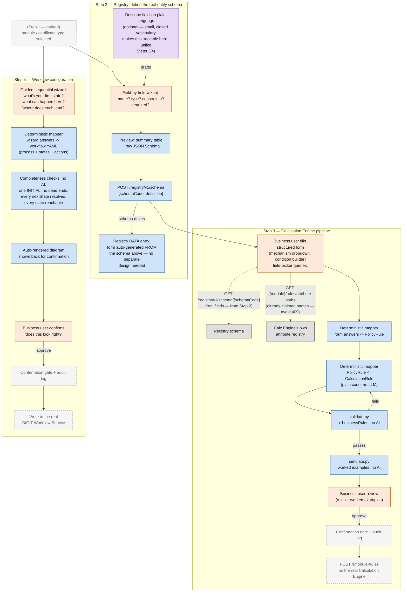

# Config pipeline: Registry schema → Calculation Engine → Workflow

This document scopes a broader picture than the rest of this repo. `DESIGN.md`/`DEMO.md`
cover one piece of a larger config puzzle — generating `CalculationRule` specs from a policy
document or a structured form. This doc places that piece in context alongside two others:
registering the real entity schema a config session is *for*, and configuring the workflow
(states/actions) that governs it.

**Update: all three of Steps 2, 3, and 4 are now built**, each as its own sibling prototype
(`registry-prototype/`, `calc-engine-prototype/`, `workflow-prototype/`) — the sections below
describe the architecture as originally reasoned through, and mostly still match what was
actually built; where a real build found something the design session got wrong or didn't
anticipate, that prototype's own README documents it rather than silently updating history here.
Step 3 specifically has *two* built paths now: `../prototype/` (the original `PolicyRule[]`-
mediated pipeline, for the backlog of already-written policy documents) and
`calc-engine-prototype/` (a fresh-authoring wizard with no intermediate stage, for someone
deciding a fee schedule from scratch — see that prototype's README for why the two need different
shapes despite targeting the same `CalculationRule[]` output).

## The four steps, at a glance

1. **Select the module / certificate type being configured.** *(Parked — not resolved in this
   doc. Open question: does "certificate type" mean the same thing as the Calculation Engine's
   `{module}` path segment, or a finer category — e.g. a specific schedule — that can exist
   several-to-one *within* one module? That distinction has a real consequence, noted in Step 3.)*
2. **Register the real entity schema** in the DIGIT Registry service — what fields this entity
   actually has, before anything downstream can reference them.
3. **Calculation Engine pipeline** — generate, validate, and simulate `CalculationRule`s for
   this module, with fields drawn from Step 2's schema, not invented ad hoc.
4. **Workflow configuration** — define the state machine (states, actions, SLAs) governing this
   process, via a guided question sequence rather than free text or a diagram.

Steps 2→3 are a hard dependency (3 cannot populate its field-picker with real fields until 2
exists). Step 4 only depends on Step 1, not on 2 or 3 — it runs in parallel, not after.

## Step 2 — Registry: define the real entity schema

**Source of truth, verified against the actual service, not assumed:** the DIGIT Registry
service (`github.com/digitnxt/digit3/tree/master/src/services/registry`) — a general-purpose,
schema-driven data store, inspired by MDMS v2, supporting JSON Schema Draft 2020-12.

This is **not** the same thing as the Calculation Engine's own `AttributePathRegistry` (see Step
3) — that one is read-only, derived automatically from whichever `CalculationRule`s have already
been written, and has no write endpoint at all. *This* Registry is the opposite: a real,
explicit, writable schema definition, done once, up front.

```
POST /registry/v1/schema
{
  "schemaCode": "trade-license-application",
  "definition": {
    "$schema": "https://json-schema.org/draft/2020-12/schema",
    "type": "object",
    "properties": {
      "employeeCount": { "type": "integer", "minimum": 0 },
      "premisesArea": { "type": "number" },
      "accessories": {
        "type": "array",
        "items": {
          "type": "object",
          "properties": {
            "type": { "type": "string" },
            "quantity": { "type": "integer" }
          }
        }
      }
    },
    "required": ["premisesArea"]
  }
}
```

Who does this: a developer/admin, once per entity, before any calc-rule or workflow config
session for that module begins. This is the *only* place a real field list originates — nothing
else in Steps 3–4 invents field names independently.

Worth knowing, not yet used by anything downstream in this doc: `x-ref-schema` lets one
registered schema's field validate against another registered schema's data (a real
foreign-key-style check across schemas) — a possible future link point between the calc-engine
schema and the workflow config, if they ever need to cross-reference each other's entities.

### How the schema itself gets authored

Same underlying question as Steps 3–4 — what input modality does someone with no JSON Schema
knowledge use — but the answer differs here, for a specific reason worth stating plainly: **JSON
Schema Draft 2020-12's own vocabulary is small and closed** (a handful of types — `string`,
`integer`, `number`, `boolean`, `array`, `object` — plus a short, well-known list of constraint
keywords — `minimum`/`maximum`, `minLength`/`maxLength`, `format`, `enum`, `required`). Unlike
"arbitrary calculation logic in a fee schedule" or "arbitrary business process," there's no
equivalent of the `SLAB`-vs-`FLAT_OR_BANDED` ambiguity to trip over here. That makes natural
language a much more tractable input for *this specific* task than it was for Steps 3 or 4.

**Recommended: a hybrid, not free text alone.** Natural language ("a name, required; an email
that must look like an email, required; an age between 0 and 150, optional") drafts the schema
via a small, bounded LLM call, but the draft always lands in a wizard for field-by-field
confirmation before it's registered — "LLM pre-fills, human confirms inside a structured surface,"
the same principle Step 3 deliberately does *without* an LLM at all, applied here because JSON
Schema's small closed vocabulary makes the draft step low-risk. This catches the one risk natural
language still has here: someone forgetting to mark a field `required`, or stating a constraint
vaguely ("age should be reasonable" — what number, exactly?).

**The wizard, concretely — deterministic, no LLM needed for this half:**
1. "What do you want to call this field?" → property name
2. "What kind of value is it?" → Text / Whole number / Decimal / Yes-No / Date / A list of things
   / A nested group of fields
   - Text → "Any length limits?" → `minLength`/`maxLength`. "Does it need to look like something
     specific?" → email / URL / date / (none) → `format`
   - Number → "Any minimum? Maximum?" → `minimum`/`maximum`
   - List → "What goes inside each item?" → recurse into this same question → `items`
   - Nested group → "What fields does this contain?" → recurse into the whole flow → nested
     `properties`
3. "Is this required, or optional?" → adds to (or omits from) the schema's `required` array
4. "Add another field?" → loop until done
5. Ask once, up front: `schemaCode`, `version` (tenant is fixed by session context)
6. Preview both a plain summary table and the raw JSON Schema before confirming

**Registry *data* entry doesn't need its own design at all** — once a schema is registered, a
data-entry form for it can be auto-generated directly from that schema (a well-known, already-
solved pattern, e.g. `react-jsonschema-form`-style renderers), since the schema already fully
describes every field, type, and constraint. The only genuinely new design work in Step 2 is
authoring the schema itself; data entry rides along for free afterward.

## Step 3 — Calculation Engine pipeline

`DESIGN.md`/`DEMO.md` document an earlier, LLM-based version of this pipeline (`extract.py`/
`synthesize.py`, proven against two real fixtures — Chennai and Bissau). **That legacy-document
path is out of scope and removed, not kept as an optional fallback** — both scripts are deleted;
`DESIGN.md`/`DEMO.md` remain only as a historical record of that earlier design. This project's
scope is the form-based path below, end to end, with no LLM step anywhere in it except the
narrow, optional schema-authoring assist described under Step 2.

**The pipeline, precisely, end to end:**

> form UI → deterministic mapper → `PolicyRule` → deterministic mapper (the mapping table below,
> plain code, not an LLM call) →
> `CalculationRule[]` → `validate.py` (business rules) + `simulate.py` (worked examples), both
> internal, no AI or human involved yet → business user sees **all** the generated rules in plain
> language + **all** the assumptions + **a few** representative worked examples → approve, or
> send a correction back.

Worth being precise about one thing that's easy to get slightly wrong here: "a few" only describes
the worked examples from `simulate.py`, deliberately chosen to be answerable rather than
exhaustive — the rules and assumptions themselves are never trimmed down; the business user sees
the complete set of both.

**Why a form, period:** a well-designed form removes the single hardest problem the old
document-extraction pipeline had — inferring fee logic from messy prose — by resolving that
ambiguity at data-entry time instead of inference time. See "why not go directly to
`CalculationRule`" below for why `PolicyRule` stays as an intermediate even here.

**The form's field-picker draws from two different registries, for two different reasons:**
- `GET /registry/v1/schema/{schemaCode}` (Step 2's output) — the real, complete field list.
- `GET /{module}/rules/attribute-paths` (the Calculation Engine's own, separate, read-only
  registry) — which of those real fields have *already* been claimed by an existing rule, and
  under what name/path, to warn before a `409 AttributePath.Conflict` would otherwise catch it
  at write time.

**The pipeline is deterministic code throughout, no LLM calls anywhere:**
- Form answers → `PolicyRule` — a direct field mapping (mechanism dropdown already matches
  `PolicyRule`'s 9-value enum; condition builder already matches `PolicyCondition`'s shape).
- `PolicyRule` → `CalculationRule` — the mapping table below, implemented as a pure function, one
  `if`/`elif` branch per mechanism.
- `validate.py` and `simulate.py` — both deterministic, both run internally, before any human or
  AI sees the output.

**Why `PolicyRule` stays as an intermediate even with a form (not just an LLM-safety measure):**
1. `CalculationRule` still isn't reviewable by a business user — someone needs to see a plain
   summary before approving, and raw `CalculationRule` (JSONPath, JSON Logic, `priority`,
   `dependsOn`) isn't legible to a non-technical reviewer.
2. The mechanism→schema mapping logic needs one home, not nine — otherwise every one of the 9
   mechanism-specific form screens duplicates the same translation logic independently.
3. It decouples the form from the Calculation Engine's own schema volatility — a `yaml` version
   change means updating one mapper, not redesigning nine form screens.

**How the mapper maps each mechanism — the actual translation logic, now that `synthesize.py`
itself is deleted, this table is the surviving spec for whoever implements the deterministic
version:**

| `PolicyRule.mechanism` | Becomes in `CalculationRule` |
|---|---|
| `FLAT_OR_BANDED` | One `RATE_MATRIX`/`FLAT` rule **per variant**, sharing one `component`. Sequencing-only `referencesComponents` → `dependsOn` alone, never `appliesOn.componentRef`. |
| `PER_UNIT` / `PER_ITEM_IN_LIST` | `RATE_MATRIX`/`PER_UNIT`, `appliesOn.jsonPath` = `rateAppliesToAttribute`. `PER_ITEM_IN_LIST` additionally sets `scope: SUBENTITY` + `subEntityPath` from `subEntityHint`. |
| `SLAB` | **One** `RATE_MATRIX` rule, `calculationType: SLAB`, `slabs` built from all variants in order — not one rule per variant. |
| `PERCENTAGE_OF_COMPONENT` | `TAX` (or `RATE_MATRIX` if not a statutory tax), `calculationType: PERCENTAGE`, `appliesOn.componentRef` + `dependsOn` from `referencesComponents`. |
| `REBATE_OF_COMPONENT` | `ADJUSTMENT`, `calculationType: FLAT` if `amountIsPercentage` is false, `PERCENTAGE` if true — checked, never defaulted. |
| `AGGREGATION` | `ruleType: AGGREGATION`, `scope: SUBENTITY`, `aggregateFunction` from `aggregateFunctionHint`, low `priority` (runs before dependents). |
| `FORMULA` / `TIME_BASED` | `calculationType: FORMULA`, `formulaVariables` built from `valueSources`, `formulaLogic` formalizing `formulaHint` into real JSON Logic. |

Plus, regardless of mechanism: every `appliesOn`/`sourceAttribute`/`formulaVariables` entry gets
exactly one of `jsonPath` or `componentRef`; conditions may leave `equals`/`from`/`to` all unset
(presence-only, valid); `module` is set once on `CalculationRuleSet`, never per-rule; every
non-obvious judgment call (a boundary interpretation, a default `effectiveFrom`) gets written to
`assumptions`.

**The open question from Step 1, concretely:** if "certificate type" is a category *within* one
module (e.g. Schedule I vs. Schedule III, both under `trade-license`), the Calculation Engine's
attribute registry does not keep them separate — it's scoped to the whole module. Two schedules
sharing a module would need an explicit `scheduleCode`/`tradeCategory` condition on every rule to
stay distinguishable; the engine offers no help here on its own. (Same gap already named in
`DESIGN.md`'s "Open schema gap" section, from a different angle.)

**End of the pipeline, same shape as `DESIGN.md`'s Stage 6-9:** business-user review of *all*
generated rules in plain language, *all* assumptions, and *a few* worked examples (not a subset of
the rules themselves) → confirmation gate + audit log (not built) → `POST /{module}/rules` on the
real Calculation Engine (not built).

## Step 4 — Workflow configuration

**Input modality, decided in-session, and why:** neither free-form natural language nor a
diagram-drawing tool — a **guided sequential question wizard**. Reasoning:
- Free text repeats the legacy-document problem: no natural pressure toward completeness, and a
  person narrating a process reliably describes the happy path and forgets exception branches
  (rejection, reassignment) unless explicitly asked.
- A diagram tool is closer, but still lets someone simply not draw a branch — it makes
  completeness *easier*, not *forced*.
- A wizard that asks *"what can happen from here?"* for every single state, and won't proceed
  without an answer, makes forgetting a branch structurally harder rather than just less likely.

**The question sequence:**
1. Name the workflow → `process.name`, `code`, `description`, overall `sla`.
2. "What's the very first thing that happens?" → becomes the `INITIAL` state.
3. For the current state: "How long should this take?" → `sla`.
4. "What can happen from here?" → one or more actions; for each, "what's it called?" (label) and
   "where does it lead?" (pick an existing state, or queue a new one).
5. Repeat 3–4 until no state is left unconfigured.
6. Any state with no actions gets asked explicitly: "Is this a good outcome or a bad outcome?" →
   forces `TERMINAL_SUCCESS` vs. `TERMINAL_FAILURE` rather than leaving an ending unclassified.
7. Render the whole thing back as an auto-generated diagram: "does this look right?" — the
   diagram is a rendering step, not a data-collection step, so it doesn't require the user to
   draw anything themselves.

**Deterministic mapping, once the wizard's answers exist**, mirrors Step 3's shape exactly:

| workflow YAML | comes from |
|---|---|
| `states[].name` | the state's label, as typed |
| `states[].code` | auto-generated from the label (`"Pending For Assignment"` → `PENDINGFORASSIGNMENT`) |
| `states[].type` | `INITIAL`/`TERMINAL_SUCCESS`/`TERMINAL_FAILURE` as tagged; `INTERMEDIATE` otherwise |
| `actions[].label` / `.code` | the arrow's label, as typed, same auto-generation |
| `actions[].nextState` | the `code` of whichever state was picked as "where does it lead" |

One real design detail carried over from Step 3's `jsonPath` registry-stability discussion:
auto-generated `code`s need to be locked once referenced elsewhere (role configs,
notifications) — renaming a state's display label later shouldn't silently change its `code`.

**Completeness checks, plain code, no AI** — same "trust deterministic code" principle as
`validate.py`:
- Exactly one `INITIAL` state.
- Every non-terminal state has at least one outgoing action (no silent dead ends).
- Every action's `nextState` resolves to a state that actually exists.
- Every state is reachable from `INIT` (catches an orphaned state nobody connected).
- Terminal states have `actions: []`.

**End of the pipeline:** auto-rendered diagram shown for confirmation → business-user approval →
confirmation gate + audit log (not built) → write to the real DIGIT Workflow Service (not built).

## Architecture diagram



## Worked examples

Both walkthroughs below are full wizard transcripts, question to final output — nothing hand-
typed as YAML/JSON until the very last step, and every field in the result traces back to a
specific answer.

### Registry schema wizard — `trade-license-application`

```
Wizard: "What's the schema code for this entity?"
You:    "trade-license-application"

Wizard: "What do you want to call this field?"
You:    "employeeCount"
Wizard: "What kind of value is it?"
You:    "Whole number"
Wizard: "Any minimum or maximum?"
You:    "Minimum 0"
Wizard: "Required, or optional?"
You:    "Required"

Wizard: "Add another field?"
You:    "Yes — premisesArea, a decimal number, minimum 0, required"

Wizard: "Add another field?"
You:    "Yes — hasLiquorLicense, yes/no, optional"

Wizard: "Add another field?"
You:    "Yes — accessories, a list of things"
Wizard: "What goes inside each item?"
You:    "type (text, required), quantity (whole number, minimum 0, required)"
Wizard: "Is 'accessories' itself required, or optional?"
You:    "Optional"

Wizard: "Add another field?"
You:    "No, that's all."
Wizard: shows a summary table + the raw JSON Schema — "does this look right?"
You:    "Yes."
```

Deterministically produces (ready for `POST /registry/v3/schema`):

```json
{
  "schemaCode": "trade-license-application",
  "definition": {
    "$schema": "https://json-schema.org/draft/2020-12/schema",
    "type": "object",
    "properties": {
      "employeeCount": { "type": "integer", "minimum": 0 },
      "premisesArea": { "type": "number", "minimum": 0 },
      "hasLiquorLicense": { "type": "boolean" },
      "accessories": {
        "type": "array",
        "items": {
          "type": "object",
          "properties": {
            "type": { "type": "string" },
            "quantity": { "type": "integer", "minimum": 0 }
          },
          "required": ["type", "quantity"]
        }
      }
    },
    "required": ["employeeCount", "premisesArea"]
  }
}
```

### Workflow wizard — `trade-license-approval`

Built entirely from questions, using the real `ProcessDefinitionInput` shape from `workflow.yaml`:

```
Wizard: "What's this workflow called, and give it a short code?"
You:    "Trade License Approval — code trade-license-approval"
Wizard: "Overall SLA for the whole process?"
You:    "5 days"

Wizard: "What's the very first thing that happens?"
You:    "Application is pending review."           -> PENDING_REVIEW, tagged INITIAL
Wizard: "How long should 'Pending Review' take?"
You:    "2 days"
Wizard: "What can happen from 'Pending Review'?"
You:    "Approved, sent back for correction, or rejected."
        -> APPROVE, RETURN (new state), REJECT (new state) queued

Wizard: "How long should 'Returned' take?"
You:    "1 day"
Wizard: "What can happen from 'Returned'?"
You:    "Resubmit, or withdraw."
Wizard: "'Resubmit' — a new state, or back to one that already exists?"
You:    "Back to Pending Review."                   -> RESUBMIT -> PENDING_REVIEW (loop, not new)
        -> WITHDRAW -> a new state, WITHDRAWN, queued

Wizard: "What can happen from 'Approved'?"  You: "Nothing, that's the end."
Wizard: "Good outcome or bad?"              You: "Good."   -> TERMINAL_SUCCESS

Wizard: "What can happen from 'Rejected'?"  You: "Nothing."
Wizard: "Good outcome or bad?"              You: "Bad."    -> TERMINAL_FAILURE

Wizard: "What can happen from 'Withdrawn'?" You: "Nothing."
Wizard: "Good outcome or bad?"              You: "Bad."    -> TERMINAL_FAILURE

Wizard: renders the diagram, "does this look right?"   You: "Yes."
```

Deterministically produces (ready for `POST /process/definition`):

```yaml
code: trade-license-approval
name: Trade License Approval
sla: 432000000
states:
  - code: PENDING_REVIEW
    name: Pending Review
    type: INITIAL
    sla: 172800000
    actions:
      - { code: APPROVE, label: Approve, nextState: APPROVED }
      - { code: RETURN,  label: Return for Correction, nextState: RETURNED }
      - { code: REJECT,  label: Reject, nextState: REJECTED }
  - code: RETURNED
    name: Returned
    type: INTERMEDIATE
    sla: 86400000
    actions:
      - { code: RESUBMIT, label: Resubmit, nextState: PENDING_REVIEW }
      - { code: WITHDRAW, label: Withdraw, nextState: WITHDRAWN }
  - code: APPROVED
    name: Approved
    type: TERMINAL_SUCCESS
    actions: []
  - code: REJECTED
    name: Rejected
    type: TERMINAL_FAILURE
    actions: []
  - code: WITHDRAWN
    name: Withdrawn
    type: TERMINAL_FAILURE
    actions: []
```

### The honest limit both examples share

The wizard forces every *question* to be asked — it cannot force an *answer* to be complete.
If someone genuinely forgets `accessories` exists, or forgets `RETURNED` has a `WITHDRAW` branch,
asking "add another field?" or "anything else from here?" doesn't make them remember something
they never thought of — that's not a wizard-vs-AI-agent problem, it's a limit of depending on one
person's memory at all.

That's not the end of the story, though — the preview step already built into both wizards (the
rendered diagram for workflow, the summary table for registry) is a genuine, complementary
mitigation, not just a final rubber stamp, and worth crediting properly rather than glossing over.
Answering questions one at a time keeps you in a "generate the next answer" mode. Seeing the
*whole* finished structure afterward — a diagram, a table — switches you into a "recognize what's
off" mode, a different cognitive task that catches different mistakes. A visual asymmetry
(`RETURNED` has one thin arrow out, `PENDING_REVIEW` has three) can catch the eye even without
consciously auditing for it — closer to proofreading by reading your own writing back than by
rewriting it from memory. The same applies to registry: a table of every field side by side, with
a `required` column, makes it easier to notice "huh, `hasLiquorLicense` is optional but everything
else near it is required — is that right?" than it was while defining each field in sequence.

Still not a guarantee — someone can look at a lopsided diagram and still not register that
anything's missing. The workflow question is also somewhat better protected than the registry one
independent of the preview, because it's anchored to a specific state already in view ("what else
from *here*") rather than a completely open prompt. Where the preview and the anchored question
both fall short, the remaining mitigation is a checklist drawn from similar existing
schemas/workflows, or a legacy form/system's field list where one exists — giving the person
something concrete to check against, not a blank memory to search. Three layers, not one: forced
questions during construction, a whole-structure preview after, and an external checklist for
whatever both still miss.

## Cross-cutting notes

- **Everything downstream of the two human-input points (form, wizard) is deterministic code —
  Step 3 has no LLM anywhere in it.** The only LLM involvement anywhere in Steps 2–4 at all is the
  narrow, optional natural-language draft in Step 2's schema authoring — the legacy-document
  extraction pipeline this project once had (`extract.py`/`synthesize.py`) is out of scope and
  deleted, not kept as a fallback.
- **Both tracks end the same way**, deliberately: business-user review → confirmation gate +
  audit log → write to the real service. One safety pattern, applied twice, not two different
  ones.
- **Steps 2, 3, and 4 are all built now** (`registry-prototype/`, `calc-engine-prototype/` +
  `../prototype/`, `workflow-prototype/`), each with its own automated test suite driven against
  real fixtures. Two real discrepancies this design session's own "verified against the real
  Registry service source" claim missed, only found once actually built and run live: the
  registry service's data-write route doesn't nest under `/schema` the way the spec/Postman
  examples show, and `x-unique`/`x-indexes` are top-level request fields, not nested inside
  `definition` — see `registry-prototype/README.md` for the full account. The Calculation Engine
  couldn't be checked against real source for most of this project's life — a GitHub search of the
  `digitnxt` org turned up no such service — that gap has since closed, with a real correction
  attached: `calculation-engine-3.0.0.yaml` was never actually missing, it was sitting locally
  (confirmed from the platform team) and had already been used once, early on (`../DEMO.md`
  documents reading it line by line to write `../prototype/validate.py`); later work searching a
  remote org just never reconnected with that. Now checked in at
  `calc-engine-prototype/fixtures/real_world/`, and `calc-engine-prototype/` re-verified against it
  field by field, finding two more real, same-shaped bugs (a missing `/calculation/v3` path prefix,
  and a bulk-array write body where the real contract wants one `POST` per rule) — see
  `calc-engine-prototype/README.md`'s "Spec found and verified" section for the full account.
- **Open, not resolved here:** the Step 1 certificate-type/module distinction, and whether Steps
  3 and 4 ever need to share data (a workflow action referencing an entity field, for instance —
  not designed for, and `x-ref-schema` in the Registry service is the most likely mechanism if
  that need arises).
