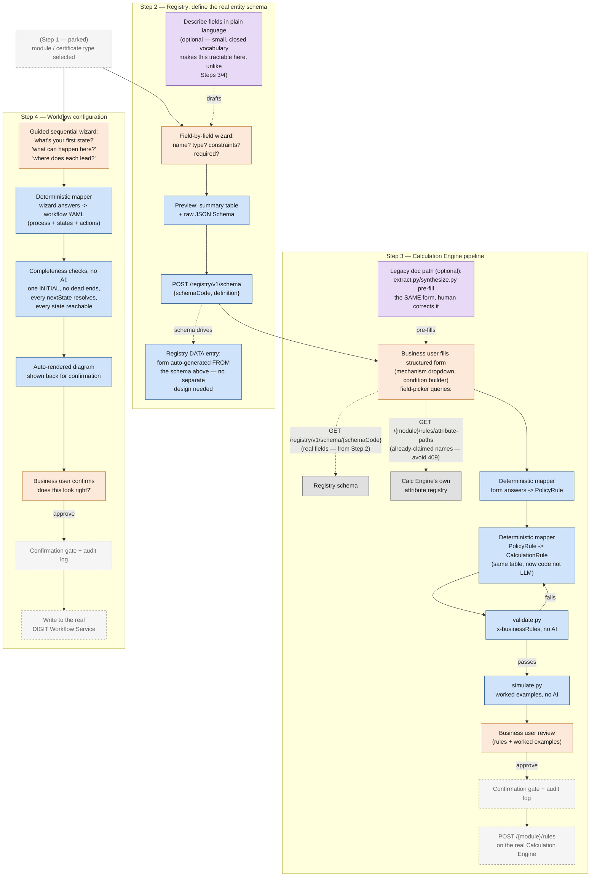

# Config pipeline: Registry schema → Calculation Engine → Workflow

This document scopes a broader picture than the rest of this repo. `DESIGN.md`/`DEMO.md`
cover one piece of a larger config puzzle — generating `CalculationRule` specs from a policy
document or a structured form. This doc places that piece in context alongside two others:
registering the real entity schema a config session is *for*, and configuring the workflow
(states/actions) that governs it. None of Steps 2–4 below are built yet; this is architecture,
not a built system, and should be read that way.

## The four steps, at a glance

1. **Select the module / certificate type being configured.** *(Parked — not resolved in this
   doc. Open question: does "certificate type" mean the same thing as the Calculation Engine's
   `{module}` path segment, or a finer category — e.g. a specific schedule — that can exist
   several-to-one *within* one module? That distinction has a real consequence, noted in Step 3.)*
2. **Register the real entity schema** in the DIGIT Registry service — what fields this entity
   actually has, before anything downstream can reference them.
3. **Calculation Engine pipeline** — generate, validate, and simulate `CalculationRule`s for
   this module, with fields drawn from Step 2's schema, not invented ad hoc.
4. **Workflow configuration** — define the state machine (states, actions, SLAs) governing this
   process, via a guided question sequence rather than free text or a diagram.

Steps 2→3 are a hard dependency (3 cannot populate its field-picker with real fields until 2
exists). Step 4 only depends on Step 1, not on 2 or 3 — it runs in parallel, not after.

## Step 2 — Registry: define the real entity schema

**Source of truth, verified against the actual service, not assumed:** the DIGIT Registry
service (`github.com/digitnxt/digit3/tree/master/src/services/registry`) — a general-purpose,
schema-driven data store, inspired by MDMS v2, supporting JSON Schema Draft 2020-12.

This is **not** the same thing as the Calculation Engine's own `AttributePathRegistry` (see Step
3) — that one is read-only, derived automatically from whichever `CalculationRule`s have already
been written, and has no write endpoint at all. *This* Registry is the opposite: a real,
explicit, writable schema definition, done once, up front.

```
POST /registry/v1/schema
{
  "schemaCode": "trade-license-application",
  "definition": {
    "$schema": "https://json-schema.org/draft/2020-12/schema",
    "type": "object",
    "properties": {
      "employeeCount": { "type": "integer", "minimum": 0 },
      "premisesArea": { "type": "number" },
      "accessories": {
        "type": "array",
        "items": {
          "type": "object",
          "properties": {
            "type": { "type": "string" },
            "quantity": { "type": "integer" }
          }
        }
      }
    },
    "required": ["premisesArea"]
  }
}
```

Who does this: a developer/admin, once per entity, before any calc-rule or workflow config
session for that module begins. This is the *only* place a real field list originates — nothing
else in Steps 3–4 invents field names independently.

Worth knowing, not yet used by anything downstream in this doc: `x-ref-schema` lets one
registered schema's field validate against another registered schema's data (a real
foreign-key-style check across schemas) — a possible future link point between the calc-engine
schema and the workflow config, if they ever need to cross-reference each other's entities.

### How the schema itself gets authored

Same underlying question as Steps 3–4 — what input modality does someone with no JSON Schema
knowledge use — but the answer differs here, for a specific reason worth stating plainly: **JSON
Schema Draft 2020-12's own vocabulary is small and closed** (a handful of types — `string`,
`integer`, `number`, `boolean`, `array`, `object` — plus a short, well-known list of constraint
keywords — `minimum`/`maximum`, `minLength`/`maxLength`, `format`, `enum`, `required`). Unlike
"arbitrary calculation logic in a fee schedule" or "arbitrary business process," there's no
equivalent of the `SLAB`-vs-`FLAT_OR_BANDED` ambiguity to trip over here. That makes natural
language a much more tractable input for *this specific* task than it was for Steps 3 or 4.

**Recommended: a hybrid, not free text alone.** Natural language ("a name, required; an email
that must look like an email, required; an age between 0 and 150, optional") drafts the schema
via a small, bounded LLM call, but the draft always lands in a wizard for field-by-field
confirmation before it's registered — the same "LLM pre-fills, human confirms inside the
structured surface" pattern already used for Step 3's legacy-document path. This catches the one
risk natural language still has here: someone forgetting to mark a field `required`, or stating a
constraint vaguely ("age should be reasonable" — what number, exactly?).

**The wizard, concretely — deterministic, no LLM needed for this half:**
1. "What do you want to call this field?" → property name
2. "What kind of value is it?" → Text / Whole number / Decimal / Yes-No / Date / A list of things
   / A nested group of fields
   - Text → "Any length limits?" → `minLength`/`maxLength`. "Does it need to look like something
     specific?" → email / URL / date / (none) → `format`
   - Number → "Any minimum? Maximum?" → `minimum`/`maximum`
   - List → "What goes inside each item?" → recurse into this same question → `items`
   - Nested group → "What fields does this contain?" → recurse into the whole flow → nested
     `properties`
3. "Is this required, or optional?" → adds to (or omits from) the schema's `required` array
4. "Add another field?" → loop until done
5. Ask once, up front: `schemaCode`, `version` (tenant is fixed by session context)
6. Preview both a plain summary table and the raw JSON Schema before confirming

**Registry *data* entry doesn't need its own design at all** — once a schema is registered, a
data-entry form for it can be auto-generated directly from that schema (a well-known, already-
solved pattern, e.g. `react-jsonschema-form`-style renderers), since the schema already fully
describes every field, type, and constraint. The only genuinely new design work in Step 2 is
authoring the schema itself; data entry rides along for free afterward.

## Step 3 — Calculation Engine pipeline

Full detail already exists in `DESIGN.md`/`DEMO.md` for the *legacy-document* version of this
pipeline (LLM-based `extract.py`/`synthesize.py`, proven against two real fixtures). This section
describes the structured-input version discussed and designed in-session, not yet built.

**Why a form instead of a document, for new (not legacy) config:** a well-designed form removes
the single hardest problem in the legacy pipeline — inferring fee logic from messy prose — by
resolving that ambiguity at data-entry time instead of inference time. See "why not go directly
to `CalculationRule`" below for why `PolicyRule` stays as an intermediate even here.

**The form's field-picker draws from two different registries, for two different reasons:**
- `GET /registry/v1/schema/{schemaCode}` (Step 2's output) — the real, complete field list.
- `GET /{module}/rules/attribute-paths` (the Calculation Engine's own, separate, read-only
  registry) — which of those real fields have *already* been claimed by an existing rule, and
  under what name/path, to warn before a `409 AttributePath.Conflict` would otherwise catch it
  at write time.

**Once the form's input is structured, most of the pipeline becomes deterministic code, not LLM
calls:**
- Form answers → `PolicyRule` — a direct field mapping (mechanism dropdown already matches
  `PolicyRule`'s 9-value enum; condition builder already matches `PolicyCondition`'s shape).
- `PolicyRule` → `CalculationRule` — the same mapping table currently written as prose in
  `synthesize.py`'s prompt, implementable as a pure function once the input is clean.
- `validate.py` and `simulate.py` — unchanged; still deterministic regardless of how the
  `PolicyRule` was produced.

**Why `PolicyRule` stays as an intermediate even with a form (not just an LLM-safety measure):**
1. `CalculationRule` still isn't reviewable by a business user — someone needs to see a plain
   summary before approving, and raw `CalculationRule` (JSONPath, JSON Logic, `priority`,
   `dependsOn`) isn't legible to a non-technical reviewer.
2. The mechanism→schema mapping logic needs one home, not nine — otherwise every one of the 9
   mechanism-specific form screens duplicates the same translation logic independently.
3. It decouples the form from the Calculation Engine's own schema volatility — a `yaml` version
   change means updating one mapper, not redesigning nine form screens.
4. It's the shared contract between this form and the legacy-document path below — both need to
   converge on one representation, or the mapping logic forks into two versions.

**The legacy-document path doesn't disappear — it becomes an optional pre-fill, feeding the same
form:** `extract.py`/`synthesize.py` (already built, proven against the Chennai fixture) draft an
answer per form field from an existing policy document; a human corrects it *inside the form*;
everything downstream of that point is the same deterministic path as fresh form entry. This is
how the LLM pipeline and the form-based pipeline converge on one system instead of two.

**The open question from Step 1, concretely:** if "certificate type" is a category *within* one
module (e.g. Schedule I vs. Schedule III, both under `trade-license`), the Calculation Engine's
attribute registry does not keep them separate — it's scoped to the whole module. Two schedules
sharing a module would need an explicit `scheduleCode`/`tradeCategory` condition on every rule to
stay distinguishable; the engine offers no help here on its own. (Same gap already named in
`DESIGN.md`'s "Open schema gap" section, from a different angle.)

**End of the pipeline, same shape as `DESIGN.md`'s Stage 6-9:** business-user review of plain-
language rules + worked examples → confirmation gate + audit log (not built) → `POST
/{module}/rules` on the real Calculation Engine (not built).

## Step 4 — Workflow configuration

**Input modality, decided in-session, and why:** neither free-form natural language nor a
diagram-drawing tool — a **guided sequential question wizard**. Reasoning:
- Free text repeats the legacy-document problem: no natural pressure toward completeness, and a
  person narrating a process reliably describes the happy path and forgets exception branches
  (rejection, reassignment) unless explicitly asked.
- A diagram tool is closer, but still lets someone simply not draw a branch — it makes
  completeness *easier*, not *forced*.
- A wizard that asks *"what can happen from here?"* for every single state, and won't proceed
  without an answer, makes forgetting a branch structurally harder rather than just less likely.

**The question sequence:**
1. Name the workflow → `process.name`, `code`, `description`, overall `sla`.
2. "What's the very first thing that happens?" → becomes the `INITIAL` state.
3. For the current state: "How long should this take?" → `sla`.
4. "What can happen from here?" → one or more actions; for each, "what's it called?" (label) and
   "where does it lead?" (pick an existing state, or queue a new one).
5. Repeat 3–4 until no state is left unconfigured.
6. Any state with no actions gets asked explicitly: "Is this a good outcome or a bad outcome?" →
   forces `TERMINAL_SUCCESS` vs. `TERMINAL_FAILURE` rather than leaving an ending unclassified.
7. Render the whole thing back as an auto-generated diagram: "does this look right?" — the
   diagram is a rendering step, not a data-collection step, so it doesn't require the user to
   draw anything themselves.

**Deterministic mapping, once the wizard's answers exist**, mirrors Step 3's shape exactly:

| workflow YAML | comes from |
|---|---|
| `states[].name` | the state's label, as typed |
| `states[].code` | auto-generated from the label (`"Pending For Assignment"` → `PENDINGFORASSIGNMENT`) |
| `states[].type` | `INITIAL`/`TERMINAL_SUCCESS`/`TERMINAL_FAILURE` as tagged; `INTERMEDIATE` otherwise |
| `actions[].label` / `.code` | the arrow's label, as typed, same auto-generation |
| `actions[].nextState` | the `code` of whichever state was picked as "where does it lead" |

One real design detail carried over from Step 3's `jsonPath` registry-stability discussion:
auto-generated `code`s need to be locked once referenced elsewhere (role configs,
notifications) — renaming a state's display label later shouldn't silently change its `code`.

**Completeness checks, plain code, no AI** — same "trust deterministic code" principle as
`validate.py`:
- Exactly one `INITIAL` state.
- Every non-terminal state has at least one outgoing action (no silent dead ends).
- Every action's `nextState` resolves to a state that actually exists.
- Every state is reachable from `INIT` (catches an orphaned state nobody connected).
- Terminal states have `actions: []`.

**End of the pipeline:** auto-rendered diagram shown for confirmation → business-user approval →
confirmation gate + audit log (not built) → write to the real DIGIT Workflow Service (not built).

## Architecture diagram



## Cross-cutting notes

- **Almost everything downstream of the two human-input points (form, wizard) is deterministic
  code.** The only LLM involvement anywhere in Steps 2–4 is the optional legacy-document pre-fill
  path into Step 3's form — clearly separated, not load-bearing for the primary path.
- **Both tracks end the same way**, deliberately: business-user review → confirmation gate +
  audit log → write to the real service. One safety pattern, applied twice, not two different
  ones.
- **Nothing in Steps 2–4 is built.** This doc is architecture reasoned through in a design
  session, verified against the real Registry service source and `calculation-engine-3.0.0.yaml`
  where specifics were checkable — not a description of working code, unlike `DESIGN.md`/
  `DEMO.md`'s Stage 2–5 (Chennai fixture), which are proven.
- **Open, not resolved here:** the Step 1 certificate-type/module distinction, and whether Steps
  3 and 4 ever need to share data (a workflow action referencing an entity field, for instance —
  not designed for, and `x-ref-schema` in the Registry service is the most likely mechanism if
  that need arises).
