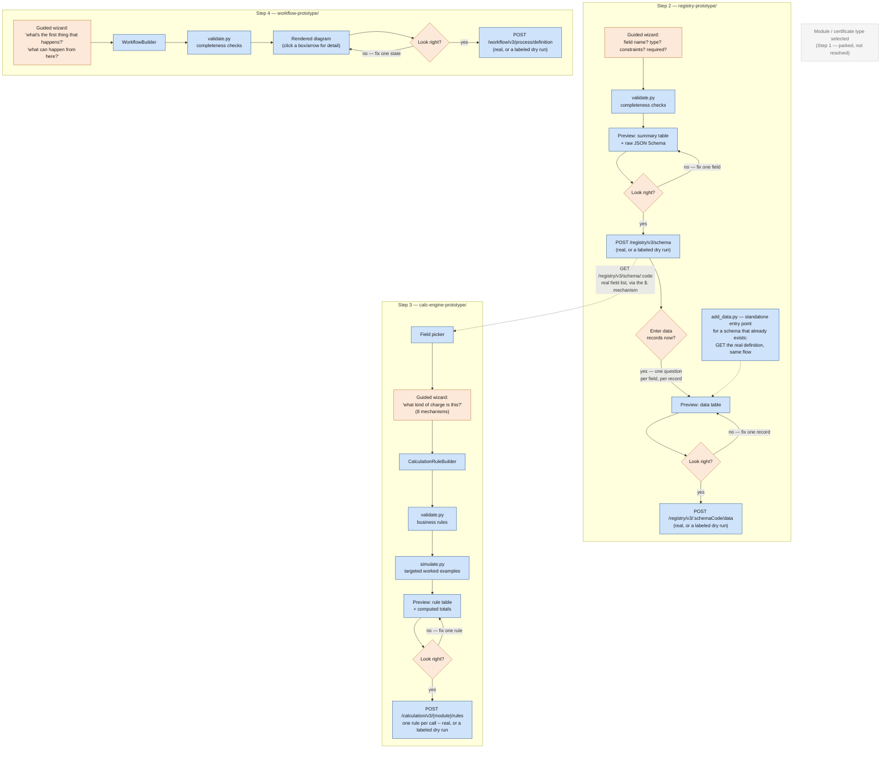

# Demo — 15 July: Config pipeline (Registry, Calculation Engine, Workflow)

**What this demo covers:** three sibling prototypes that let a business user (not a developer)
configure a new module in DIGIT end to end — the entity schema, the fee/tax rules, and the
approval process — through guided questions instead of hand-written JSON/YAML. Each one is a
standalone, offline-runnable tool with its own automated test suite. This doc is the demo-facing
walkthrough and scorecard, and now the canonical architecture reference too.

---

## TL;DR

| Step | Prototype | What it produces | Verified against |
|---|---|---|---|
| 2 — Register the entity schema | `registry-prototype/` | `POST /registry/v3/schema` body | Real Go source in `digitnxt/digit3`, plus every registry schema found scraping all 8 repos in the org |
| 2 — Enter data records against it | `registry-prototype/` (`data_entry.py`/`add_data.py`) | `POST /registry/v3/:schemaCode/data` body | Same real Go source verification as the schema-write path above |
| 3 — Author fee/tax rules | `calc-engine-prototype/` | `POST /calculation/v3/{module}/rules` body (one rule per call) | The real OpenAPI spec (`calculation-engine-3.0.0.yaml`, confirmed from the platform team), plus 30 real, authoritative rule bodies (`calculation-rule-examples.pdf`) |
| 4 — Configure the approval workflow | `workflow-prototype/` | `POST /workflow/v3/process/definition` body | Real Go source in `digitnxt/digit3`, plus 3 real production workflow configs (BPA, BPA_LOW, PGR67) |

Every prototype follows the **same five-stage shape**: guided questions → deterministic builder →
deterministic validator → a plain-language preview (table or diagram, not a JSON dump) → explicit
confirm → real-or-dry-run write. No LLM anywhere in this loop. Combined automated test count as of
this demo: **445 checks** (calc-engine) + tests in registry (~133) + workflow (~83) — see the
scorecard near the end.

---

## Architecture diagram

The one visual to show first — the same five-stage pattern (guided questions → build → validate →
preview → confirm → write) instantiated three times, with the one real dependency between them
(Step 3's field picker reads Step 2's schema) and Step 4 running independently in parallel:



Orange = a human decides something here; blue = deterministic code, no AI. No purple/AI-colored box
anywhere in this diagram. This is a demo-scoped view showing only what's actually built and
runnable today — it deliberately omits the not-yet-built confirmation gate/audit log (§5 covers
that).

---

## 1. The one shared pattern

Every prototype is built the same way, and this is deliberate — the same "fix one thing, don't
restart everything" lesson learned once (in workflow) was carried forward into the other two
rather than re-learned:

```
guided questions  →  testable builder  →  deterministic validator  →  plain-language preview
     (CLI)          (one method per        (no AI — a fixed          (table or diagram,
                      concept, unit-         rulebook, checked          click-to-expand detail,
                      testable without        every time)               zero external deps)
                      the CLI)
                                                                              │
                                                                              ▼
                                                                     explicit confirmation
                                                                              │
                                                                              ▼
                                                              real POST (env vars set) or a
                                                              clearly-labeled DRY RUN (prints
                                                              exactly what would be sent)
```

And if the answer at the confirmation step is "no, that's wrong" — none of the three prototypes
discard the whole session. Each offers a menu to redo/add/delete one part and re-preview, a fix
found necessary the hard way in `workflow-prototype/` and then carried into the other two from the
start.

---

## 2. Walkthrough: Registry (Step 2)

**Purpose:** register the real entity schema for a module — what fields it has, their types,
constraints, and which combinations must be unique — before anything downstream (Calculation
Engine's field picker) can reference them. This is *not* the Calculation Engine's own
`AttributePathRegistry` (that one is read-only, auto-derived from whatever rules already exist,
no write endpoint) — the Registry is a real, explicit, writable schema definition, done once, up
front.

**Full walkthrough — `trade-license-application`:**

```
Wizard: "What's the schema code for this entity?"
You:    "trade-license-application"

Wizard: "What do you want to call this field?"
You:    "employeeCount"
Wizard: "What kind of value is it?"
You:    "Whole number"
Wizard: "Any minimum or maximum?"
You:    "Minimum 0"
Wizard: "Required, or optional?"
You:    "Required"

Wizard: "Add another field?"
You:    "Yes — premisesArea, a decimal number, minimum 0, required"

Wizard: "Add another field?"
You:    "Yes — hasLiquorLicense, yes/no, optional"

Wizard: "Add another field?"
You:    "Yes — accessories, a list of things"
Wizard: "What goes inside each item?"
You:    "type (text, required), quantity (whole number, minimum 0, required)"
Wizard: "Is 'accessories' itself required, or optional?"
You:    "Optional"

Wizard: "Add another field?"
You:    "No, that's all."
Wizard: shows a summary table + the raw JSON Schema — "does this look right?"
You:    "Yes."
```

**Produces**, ready for the real, verified `POST /registry/v3/schema`:

```json
{
  "schemaCode": "trade-license-application",
  "definition": {
    "$schema": "https://json-schema.org/draft/2020-12/schema",
    "type": "object",
    "properties": {
      "employeeCount": { "type": "integer", "minimum": 0 },
      "premisesArea": { "type": "number", "minimum": 0 },
      "hasLiquorLicense": { "type": "boolean" },
      "accessories": {
        "type": "array",
        "items": {
          "type": "object",
          "properties": {
            "type": { "type": "string" },
            "quantity": { "type": "integer", "minimum": 0 }
          },
          "required": ["type", "quantity"]
        }
      }
    },
    "required": ["employeeCount", "premisesArea"]
  }
}
```

**What it also supports** (found necessary by scraping real schemas across the whole digitnxt
org, not designed speculatively): `pattern` (10-digit mobile numbers, 6-digit pincodes, expressed
in plain language, not raw regex), `minimum`/`maximum` bounds (lat/long-style), nested
"group of fields" (one level deep — an `address` object with its own sub-fields), unique
constraints (single-field and compound), and a second phase (`data_entry.py`/`add_data.py`) that
auto-generates a record-entry form directly from whatever schema was just registered.

---

## 3. Walkthrough: Calculation Engine (Step 3, fresh authoring)

**Purpose:** author `CalculationRule[]` for a module from scratch — fees, taxes, rebates, tiered
bands, aggregations, real math — through the same eight-mechanism menu
`reference/calculation-rule-vocabulary.md` already documents, made interactive. Every field
reference into the entity's real data goes through the same `$.`-path mechanism, drawing on
whatever schema Step 2 already registered — a condition on `premisesArea` isn't typed by hand, it's
picked from the real field list.

**The mechanism menu:**

| Wizard option | `CalculationRule` shape |
|---|---|
| A flat amount every time | `calculationType: FLAT` |
| A rate × some field | `calculationType: PER_UNIT`, `appliesOn.jsonPath` |
| Per item in a repeating list | `scope: SUBENTITY`, `subEntityPath` |
| Tiered/marginal bands | `calculationType: SLAB`, `slabs` |
| A percentage of another fee | `calculationType: PERCENTAGE`, `appliesOn.componentRef` + `dependsOn` |
| A rebate/deduction | `ruleType: ADJUSTMENT`, `appliesOn.componentRef` |
| Total a repeating list | `ruleType: AGGREGATION`, `scope: SUBENTITY` |
| Real math | `calculationType: FORMULA`, `formulaVariables` + `formulaLogic` |

**Robust real example — a full tax/cess stack, taken directly from `calculation-rule-examples.pdf`
and now a permanent regression fixture in this prototype (`test_real_world_examples.py`,
`test_03_tax_stack_totals_correctly`):**

Five rules, one base fee, four dependents — the single most common real pattern in a fee schedule:

```json
[
  { "ruleType": "RATE_MATRIX", "component": "LICENSE_FEE", "scope": "ENTITY", "conditions": {},
    "calculationType": "FLAT", "value": 500, "priority": 10, "effectiveFrom": "2024-04-01" },

  { "ruleType": "TAX", "component": "CGST", "scope": "ENTITY", "conditions": {},
    "calculationType": "PERCENTAGE", "value": 9,
    "appliesOn": { "componentRef": "LICENSE_FEE" }, "dependsOn": ["LICENSE_FEE"],
    "priority": 20, "effectiveFrom": "2024-04-01" },

  { "ruleType": "TAX", "component": "SGST", "scope": "ENTITY", "conditions": {},
    "calculationType": "PERCENTAGE", "value": 9,
    "appliesOn": { "componentRef": "LICENSE_FEE" }, "dependsOn": ["LICENSE_FEE"],
    "priority": 20, "effectiveFrom": "2024-04-01" },

  { "ruleType": "TAX", "component": "FIRE_CESS", "scope": "ENTITY", "conditions": {},
    "calculationType": "PERCENTAGE", "value": 1,
    "appliesOn": { "componentRef": "LICENSE_FEE" }, "dependsOn": ["LICENSE_FEE"],
    "priority": 20, "effectiveFrom": "2024-04-01" },

  { "ruleType": "TAX", "component": "CANCER_CESS", "scope": "ENTITY", "conditions": {},
    "calculationType": "FLAT", "value": 50, "dependsOn": ["LICENSE_FEE"],
    "priority": 20, "effectiveFrom": "2024-04-01" }
]
```

Worth pointing out live in the demo: `CANCER_CESS` is a flat ₹50 with nothing to read from
`LICENSE_FEE` mathematically, yet it still declares `dependsOn: ["LICENSE_FEE"]` — purely so the
engine never computes it before the base fee exists. The wizard's preview simulates this whole
stack and shows the actual number: **₹500 + ₹45 + ₹45 + ₹5 + ₹50 = ₹645**, not just five rule
definitions someone has to add up in their head.

**A second real example worth showing — the SLAB rate bug's own confirmation, live**, because it's
the clearest demonstration of why worked-example simulation exists at all. A two-tier property tax
slab, verbatim from the same source document:

```json
{ "calculationType": "SLAB", "appliesOn": { "jsonPath": "$.propertyValue" },
  "slabs": [
    { "from": 0, "to": 500000, "rate": 0.5 },
    { "from": 500000, "to": null, "rate": 1 }
  ] }
```

The document's own prose: *"₹700,000 pays 0.5% on the first ₹500,000 and 1% on the remaining
₹200,000."* Simulating this rule live shows **₹4,500** — and that number is *only* right because a
real bug (`rate` being applied as a raw multiplier instead of divided by 100, which would have
produced ₹450,000 — a 64% property tax) was caught and fixed by checking the simulator's output
against this exact sentence, not by inspecting the JSON's shape.

**Test coverage:** 25 (builder+validate) + 15 (formula parser) + 16 (worked-examples generator) +
24 (wizard) + 24 (render) + 17 (real-write-path) + **324 (stress test against all 30 real
examples)** = **445 checks**.

---

## 4. Walkthrough: Workflow (Step 4)

**Purpose:** define the approval process (states, actions, SLAs) for a module, through a guided
sequence rather than free text or a diagram tool — verified directly against
`digit-specs/v3.0.0/workflow.yaml`'s real `ActionInput`/`StateInput`/`ProcessDefinitionInput`
shapes.

**Full walkthrough — `trade-license-approval`:**

```
Wizard: "What's this workflow called, and give it a short code?"
You:    "Trade License Approval — code trade-license-approval"
Wizard: "Overall SLA for the whole process?"
You:    "5 days"

Wizard: "What's the very first thing that happens?"
You:    "Application is pending review."           -> PENDING_REVIEW, tagged INITIAL
Wizard: "How long should 'Pending Review' take?"
You:    "2 days"
Wizard: "What can happen from 'Pending Review'?"
You:    "Approved, sent back for correction, or rejected."
        -> APPROVE, RETURN (new state), REJECT (new state) queued

Wizard: "How long should 'Returned' take?"
You:    "1 day"
Wizard: "What can happen from 'Returned'?"
You:    "Resubmit, or withdraw."
Wizard: "'Resubmit' — a new state, or back to one that already exists?"
You:    "Back to Pending Review."                   -> RESUBMIT -> PENDING_REVIEW (loop, not new)
        -> WITHDRAW -> a new state, WITHDRAWN, queued

Wizard: "What can happen from 'Approved'?"  You: "Nothing, that's the end."
Wizard: "Good outcome or bad?"              You: "Good."   -> TERMINAL_SUCCESS

Wizard: "What can happen from 'Rejected'?"  You: "Nothing."
Wizard: "Good outcome or bad?"              You: "Bad."    -> TERMINAL_FAILURE

Wizard: "What can happen from 'Withdrawn'?" You: "Nothing."
Wizard: "Good outcome or bad?"              You: "Bad."    -> TERMINAL_FAILURE

Wizard: renders the diagram, "does this look right?"   You: "Yes."
```

**Produces**, ready for the real, verified `POST /workflow/v3/process/definition`:

```yaml
code: trade-license-approval
name: Trade License Approval
sla: 432000000
states:
  - code: PENDING_REVIEW
    name: Pending Review
    type: INITIAL
    sla: 172800000
    actions:
      - { code: APPROVE, label: Approve, nextState: APPROVED }
      - { code: RETURN,  label: Return for Correction, nextState: RETURNED }
      - { code: REJECT,  label: Reject, nextState: REJECTED }
  - code: RETURNED
    name: Returned
    type: INTERMEDIATE
    sla: 86400000
    actions:
      - { code: RESUBMIT, label: Resubmit, nextState: PENDING_REVIEW }
      - { code: WITHDRAW, label: Withdraw, nextState: WITHDRAWN }
  - code: APPROVED
    name: Approved
    type: TERMINAL_SUCCESS
    actions: []
  - code: REJECTED
    name: Rejected
    type: TERMINAL_FAILURE
    actions: []
  - code: WITHDRAWN
    name: Withdrawn
    type: TERMINAL_FAILURE
    actions: []
```

**The preview is a genuine diagram, not a JSON dump** — a self-contained, offline-viewable,
click-to-expand HTML diagram (click a box for its SLA and every action's roles; click an arrow for
that one action's own detail). This is worth showing live: an asymmetry like "`RETURNED` has one
thin arrow out, `PENDING_REVIEW` has three" is the kind of thing a rendered picture surfaces at a
glance that a YAML file doesn't.

**Deliberately does not use `digitnxt/digit-client-tools`'s own official `digit create-workflow`
CLI** for the write step — its client library's `ActionInput` struct has no `roles`/`assigneeCheck`
fields at all, meaning the *official* tool silently drops role restrictions on write even though the
real server supports them. Worth saying out loud in the demo: this isn't a hypothetical risk, it's
a bug already present in the tool DIGIT itself ships.

**Real bugs this prototype found and fixed:** an earlier version of the confirmation gate discarded
the *entire* session on "no" — fixed to a redo/add/delete-and-fix-the-fallout menu (deleting a state
now also asks what to do about any dangling reference left pointing at it), which then became the
pattern copied into both other prototypes.

**Test coverage:** 16 (builder+validate) + 39 (wizard) + 17 (render) + 11 (real-write-path) = **83
checks**, replaying three real production configs (BPA, BPA_LOW, PGR67) byte-for-byte through the
wizard.

**Pros:** the diagram preview is the strongest "recognize what's off, not just re-read what you
typed" mitigation of the three, and it's anchored per-state ("what else from *here*") rather than
one open-ended prompt, which independently helps completeness. Real production configs prove the
wizard can reproduce what's actually running today, not just a toy example.

**Limitations:** `EscalationConfig` (per-state SLA escalation rules) isn't modeled — this covers
process/state/action authoring only. The diagram's layout algorithm (BFS column layering, self-loops
routed into their own lane) is verified correct up to the real examples tested (14 states) — not
manually verified readable for something much larger or more tangled than that.

---

## 5. Exact steps from here to production-ready

Ordered by dependency and risk, not by ease — each step assumes the ones before it are done,
and doing them out of order means redoing work (e.g. a nice UI wizard built on top of an
unverified Calculation Engine contract just moves the risk somewhere prettier).

1. ~~Close the Calculation Engine verification gap.~~ **Done.** The real OpenAPI spec
   (`calculation-engine-3.0.0.yaml`, confirmed from the platform team) has been found and
   `calc-engine-prototype/` re-verified against it field by field — see its README's "Spec found
   and verified" section. Found and fixed two more real bugs in the process, same shape as
   Registry's own findings: the write path was missing a `/calculation/v3` prefix, and `POST` was
   sending the whole rule set as one bulk-array body where the real contract wants one request per
   rule. One residual gap: the exact header names behind the spec's `ClientId`/`ClientSecret`/
   `TimeStamp` parameters are still unconfirmed (`$ref`'d to a `digit-specs` common.yaml this
   project doesn't have local access to) — not guessed, flagged directly in `wizard.py`.

2. **Build the confirmation gate + audit log — the single highest-leverage item, common to all
   three.** Currently "confirm" is a plain yes/no immediately before a real write; nothing shows the
   literal endpoint/payload being sent, and nothing persists a record of who wrote what.
   - Literal endpoint + exact payload shown to the approver before the write fires.
   - One persisted audit-log writer, reused by all three prototypes (not three separate
     implementations) — who, what, exact payload, when.
   - This is the biggest gap between "safe prototype" and "safe to point at a real service," and it
     blocks nothing else below — build it early.

3. **Add update support.** All three are create-only today.
   - Registry: `PUT /registry/v3/schema/:schemaCode` (version bump).
   - Calculation Engine: a rule-set amendment path (deactivate/append rules against an existing
     module, not just author a brand-new set).
   - Workflow: a process-definition revision path.

4. **Wrap the config session's own lifecycle in the real Workflow Service**, not a bespoke status
   column — DRAFT_GENERATED → PENDING_FOR_REVIEW → APPROVED → PUBLISHED, using the very same
   service Step 4 configures. Sequence this *after* step 2 (the confirmation gate) is solid — using
   the Workflow Service to govern workflow *configuration itself* is elegant, but building it before
   the underlying wizard/gate is proven risks a confusing circular dependency in review.

5. **Replace the CLI with a real UI wizard** — same question shape, no change to the underlying
   builder/validate/simulate logic. Deliberately sequenced *after* steps 1–4: a polished UI on top
   of an unverified contract or a missing audit trail just moves the risk somewhere more convincing-
   looking, not somewhere safer.

6. **Put a real API Gateway in front.** Forward the actual approving user's own token on every
   write — never a service account — and enforce RBAC on who's allowed to configure which
   module/schema/workflow. None of the three prototypes decide this themselves today; it's a
   platform-service concern layered on top, not something to bolt onto the wizards directly.

7. **Resolve the two parked design questions before onboarding a second real module** — they'll
   bite exactly then, not before:
   - Step 1's module/certificate-type distinction (is "certificate type" the same as the
     Calculation Engine's `{module}` segment, or a finer category that can exist several-to-one
     *within* one module — real consequence for the attribute registry, which is scoped to the
     whole module).
   - Whether Steps 3 and 4 ever need to cross-reference each other (a workflow action naming a
     calculation-rule component, or vice versa) — `x-ref-schema` on the Registry service is the
     likely mechanism, not designed for yet.

8. **Scale-test past today's verified bounds** before relying on this for a real, large rollout —
   each of these is a known, named limit, not a silent one:
   - Registry: a real module needing two-plus levels of nested objects (the wizard's UI stops at
     one; the model doesn't).
   - Calculation Engine: either build combinatorial worked-example coverage or explicitly
     communicate the current one-variable-at-a-time cap to whoever reviews a rule set.
   - Workflow: confirm the diagram layout stays legible on a real 30+-state process — verified only
     up to 14 so far.

9. **Pilot on one real module, end to end, against live services, before generalizing.** Recommend
   reusing `trade-license` — already the running example in every walkthrough above (§2–§4), so
   there's no new domain knowledge to build before validating that all three prototypes, wired to
   real services with the gate/audit log/RBAC from steps 2–6 in place, actually produce a working
   module together.

## 6. Rigor scorecard (evidence, not a claim)

| Prototype | Automated checks | Verified against | Real bugs found & fixed |
|---|---|---|---|
| Registry | 133 | Real Go source (`digit3`) + every schema scraped from 8 org repos | 5 (wrong API version, missing `/schema/` path segment, `x-unique`/`x-indexes` misplacement, wrong auth header, schema-code-with-a-dot rejected) |
| Calculation Engine | 445 | The real OpenAPI spec (`calculation-engine-3.0.0.yaml`, confirmed from the platform team) + 30 real, authoritative example rule bodies | 8 (Slab rate `/100`, AGGREGATION field absence — guessed twice — relative sub-entity paths, `derivedFrom` keying, componentRef-to-aggregation fallback, dropped `if`/comparison support, missing `/calculation/v3` path prefix, bulk-array write body instead of one-`POST`-per-rule) |
| Workflow | 83 | Real Go source (`digit3`) + 3 real production configs (BPA, BPA_LOW, PGR67) | 1 (confirmation gate discarding the whole session on "no" — became the shared fix-one-thing pattern) |
| **Total** | **661** | | **14** |

Every one of these bugs is the kind that would otherwise ship silently — a `201 Created` response
that doesn't actually enforce the constraint just sent, a rule that computes a number 100x too
large, a workflow tool that silently drops role restrictions, a write path missing the version
prefix every sibling service actually uses. None were caught by "does this look like valid JSON" —
all were caught by checking against something real: real source code, a real OpenAPI spec, real
production configs, or a real authoritative example document's own stated arithmetic.
