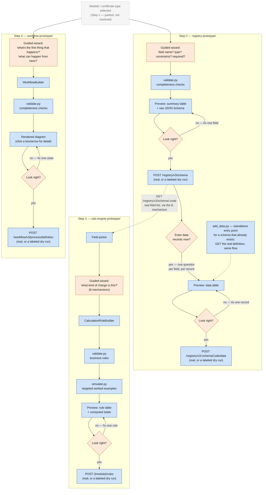

# Demo — 15 July: Config pipeline (Registry, Calculation Engine, Workflow)

**What this demo covers:** three sibling prototypes that let a business user (not a developer)
configure a new module in DIGIT end to end — the entity schema, the fee/tax rules, and the
approval process — through guided questions instead of hand-written JSON/YAML. Each one is a
standalone, offline-runnable tool with its own automated test suite. Full architecture context
lives in `CONFIG-PIPELINE.md`; this doc is the demo-facing walkthrough, FAQ, and scorecard.

**Not covered here:** the older `PolicyRule[]`-mediated pipeline for extracting rules from
*already-written* policy documents (`prototype/`, `DESIGN.md`/`DEMO.md`) — that's a fourth,
sibling path solving a different problem (a document backlog), briefly noted where relevant but
not the focus of tomorrow's walkthrough.

---

## TL;DR

| Step | Prototype | What it produces | Verified against |
|---|---|---|---|
| 2 — Register the entity schema | `registry-prototype/` | `POST /registry/v3/schema` body | Real Go source in `digitnxt/digit3`, plus every registry schema found scraping all 8 repos in the org |
| 3 — Author fee/tax rules | `calc-engine-prototype/` | `POST /{module}/rules` body | 30 real, authoritative rule bodies (`calculation-rule-examples.pdf`) — no real service exists to check against otherwise (see "The one caveat" below) |
| 4 — Configure the approval workflow | `workflow-prototype/` | `POST /workflow/v3/process/definition` body | Real Go source in `digitnxt/digit3`, plus 3 real production workflow configs (BPA, BPA_LOW, PGR67) |

Every prototype follows the **same five-stage shape**: guided questions → deterministic builder →
deterministic validator → a plain-language preview (table or diagram, not a JSON dump) → explicit
confirm → real-or-dry-run write. No LLM anywhere in this loop. Combined automated test count as of
this demo: **441 checks** (calc-engine) + tests in registry (~133) + workflow (~83) — see the
scorecard near the end.

---

## Architecture diagram

The one visual to show first — the same five-stage pattern (guided questions → build → validate →
preview → confirm → write) instantiated three times, with the one real dependency between them
(Step 3's field picker reads Step 2's schema) and Step 4 running independently in parallel:



Orange = a human decides something here; blue = deterministic code, no AI. No purple/AI-colored box
anywhere in this diagram — worth pointing at directly when the "why no AI" question comes up (§4).
The full picture, including the not-yet-built confirmation gate/audit log and the sibling
`PolicyRule[]` extraction path, lives in `CONFIG-PIPELINE.md`'s own architecture diagram — this is
the trimmed, demo-scoped version showing only what's actually built and runnable today.

---

## 1. The problem

Today, configuring a new DIGIT module (say, trade licenses for a new city) means a developer
reading a fee notification or requirements doc, deciding the JSON Schema for the application data,
hand-authoring `CalculationRule` JSON for every fee/tax/rebate, and hand-authoring workflow YAML
for the approval process — three different hand-written artifacts, each with its own easy-to-get-
wrong shape (a `SLAB` vs `FLAT_OR_BANDED` mixup, a forgotten `dependsOn`, an unreachable workflow
state), each verified only by a human proofreading JSON.

The goal: let someone who knows the *business* rules (not the JSON schema) produce all three
artifacts correctly, through questions they can actually answer, with a plain-language preview they
can actually check before anything gets written to a real service.

## 2. Why three prototypes, not one

The three steps have a real dependency shape, not an arbitrary split:

```
Step 2 (Registry)  ──hard dependency──▶  Step 3 (Calculation Engine)
                                          (needs real field names to reference)

Step 1 (module/certificate type — parked, not resolved)
   │
   └────────────────────────────────────▶  Step 4 (Workflow)
                                          (only depends on Step 1, runs in parallel with 2/3)
```

Step 3 cannot offer a real field picker until Step 2's schema exists — you can't write a condition
on `premisesArea` before something has registered that `premisesArea` exists and what type it is.
Step 4 has no such dependency: a workflow's states/actions don't reference entity fields at all, so
it can be configured independently, any time after the module/certificate type itself is decided.

## 3. The one shared pattern

Every prototype is built the same way, and this is deliberate — the same "fix one thing, don't
restart everything" lesson learned once (in workflow) was carried forward into the other two
rather than re-learned:

```
guided questions  →  testable builder  →  deterministic validator  →  plain-language preview
     (CLI)          (one method per        (no AI — a fixed          (table or diagram,
                      concept, unit-         rulebook, checked          click-to-expand detail,
                      testable without        every time)               zero external deps)
                      the CLI)
                                                                              │
                                                                              ▼
                                                                     explicit confirmation
                                                                              │
                                                                              ▼
                                                              real POST (env vars set) or a
                                                              clearly-labeled DRY RUN (prints
                                                              exactly what would be sent)
```

And if the answer at the confirmation step is "no, that's wrong" — none of the three prototypes
discard the whole session. Each offers a menu to redo/add/delete one part and re-preview, a fix
found necessary the hard way in `workflow-prototype/` and then carried into the other two from the
start.

---

## 4. Product & tech FAQ

**Q: Why no AI/LLM in the loop at all?**
Because none of what these three steps do is actually a language-understanding problem. Deciding a
fee structure, a schema, or an approval process is a person making decisions they already know the
answer to — the hard part was never "understand what the fee schedule means," it's "translate a
decision into the right JSON shape without a typo." That's exactly what deterministic code is
better at than an LLM: a fixed rulebook, checked the same way every time, with no risk of a
plausible-sounding but wrong JSON Logic expression. (The *sibling* `PolicyRule[]` pipeline in
`prototype/` does use an LLM — but only for its one genuinely language-shaped sub-problem, reading
an *existing* prose document and locating/extracting what it says. That's not what tomorrow's three
prototypes do.)

**Q: So where did AI touch this at all?**
Two narrow, optional places, both named explicitly in `CONFIG-PIPELINE.md`, neither built yet: (1) a
free-text-to-draft-schema assist in Step 2, because JSON Schema's own vocabulary is small and
closed enough that an LLM draft is low-risk as long as a human still confirms every field in a
wizard afterward; (2) nothing in Steps 3/4 — both are 100% guided questions, no natural-language
input anywhere.

**Q: Why a wizard instead of a form, a diagram tool, or free text?**
Tried reasoning through all three for Step 4 (workflow) specifically: free text repeats the
"forgets the exception branch" problem messy prose always has; a diagram tool still lets someone
just not draw a branch. A wizard that asks *"what can happen from here?"* for every single state
and won't proceed without an answer makes forgetting a branch structurally harder, not just less
likely. Same reasoning applies to Steps 2/3 — a guided question sequence forces the questions to be
asked; nothing forces a *complete* answer (see the honest limit noted in §7 below), but that's a
limit of depending on any one person's memory, not something a different input modality would fix
either.

**Q: Is this production-ready?**
No — clearly staged as prototypes, and the READMEs say so explicitly rather than overclaim.
Concretely not built yet, in all three: the confirmation gate + audit log (the write step happens
right after a plain "yes/no" — no MCP-style literal-endpoint-shown gate, no persisted audit trail
yet), and schema/rule/workflow *updates* (all three are create-only). See §8 for the full list and
§9 for what changes on the path to production.

**Q: How do you know this actually matches the real DIGIT services, and not just your own
assumptions about them?**
Registry and Workflow: checked directly against real Go source in `digitnxt/digit3` (not just
`swagger.yaml`/READMEs) — and this mattered, because the spec and the implementation disagreed in
five separate, real ways for Registry alone (wrong API version everywhere in the docs, a whole path
segment silently dropped, two fields landing in the wrong place in the request body, a wrong auth
header name, and an error-envelope shape that doesn't match what's documented) — see §7.1's
discrepancy list. Calculation Engine is the one honest exception: **no such service exists anywhere
in the digitnxt org** to check against (confirmed by listing `src/services/` and an org-wide code
search) — that gap is stated up front in the prototype's README rather than glossed over, and
partly closed by stress-testing against 30 real, authoritative example rule bodies instead (§7.2).

**Q: What happens if the wizard's own field picker or write path is wrong?**
That's exactly the class of bug "verify against real source" and "stress-test against real
examples" were built to catch, and did catch, repeatedly — every real bug found is named in each
prototype's README rather than fixed silently, and each one now has a permanent regression test.
§10 has the full tally: 9 real, confirmed bugs found across all three prototypes so far, entirely
before any of this touched a live service.

**Q: Why does Calculation Engine have *two* different authoring paths (`prototype/` and
`calc-engine-prototype/`)?**
They solve genuinely different problems, not a redundant duplicate. `prototype/`'s
`PolicyRule[]`-mediated pipeline exists for the backlog of **already-written** policy documents —
someone has to *read and understand* an existing gazette/notification, which is a real language
task, hence the LLM extraction step. `calc-engine-prototype/` (what tomorrow's demo covers) is for
someone **deciding a fee schedule from scratch** — there's no document to extract from, so the
wizard's own questions are the source of truth and no LLM step is needed at all. Same target output
(`CalculationRule[]`), different starting point.

---

## 5. Walkthrough: Registry (Step 2)

**Purpose:** register the real entity schema for a module — what fields it has, their types,
constraints, and which combinations must be unique — before anything downstream (Calculation
Engine's field picker) can reference them. This is *not* the Calculation Engine's own
`AttributePathRegistry` (that one is read-only, auto-derived from whatever rules already exist,
no write endpoint) — the Registry is a real, explicit, writable schema definition, done once, up
front.

**Full walkthrough — `trade-license-application`:**

```
Wizard: "What's the schema code for this entity?"
You:    "trade-license-application"

Wizard: "What do you want to call this field?"
You:    "employeeCount"
Wizard: "What kind of value is it?"
You:    "Whole number"
Wizard: "Any minimum or maximum?"
You:    "Minimum 0"
Wizard: "Required, or optional?"
You:    "Required"

Wizard: "Add another field?"
You:    "Yes — premisesArea, a decimal number, minimum 0, required"

Wizard: "Add another field?"
You:    "Yes — hasLiquorLicense, yes/no, optional"

Wizard: "Add another field?"
You:    "Yes — accessories, a list of things"
Wizard: "What goes inside each item?"
You:    "type (text, required), quantity (whole number, minimum 0, required)"
Wizard: "Is 'accessories' itself required, or optional?"
You:    "Optional"

Wizard: "Add another field?"
You:    "No, that's all."
Wizard: shows a summary table + the raw JSON Schema — "does this look right?"
You:    "Yes."
```

**Produces**, ready for the real, verified `POST /registry/v3/schema`:

```json
{
  "schemaCode": "trade-license-application",
  "definition": {
    "$schema": "https://json-schema.org/draft/2020-12/schema",
    "type": "object",
    "properties": {
      "employeeCount": { "type": "integer", "minimum": 0 },
      "premisesArea": { "type": "number", "minimum": 0 },
      "hasLiquorLicense": { "type": "boolean" },
      "accessories": {
        "type": "array",
        "items": {
          "type": "object",
          "properties": {
            "type": { "type": "string" },
            "quantity": { "type": "integer", "minimum": 0 }
          },
          "required": ["type", "quantity"]
        }
      }
    },
    "required": ["employeeCount", "premisesArea"]
  }
}
```

**What it also supports** (found necessary by scraping real schemas across the whole digitnxt
org, not designed speculatively): `pattern` (10-digit mobile numbers, 6-digit pincodes, expressed
in plain language, not raw regex), `minimum`/`maximum` bounds (lat/long-style), nested
"group of fields" (one level deep — an `address` object with its own sub-fields), unique
constraints (single-field and compound), and a second phase (`data_entry.py`/`add_data.py`) that
auto-generates a record-entry form directly from whatever schema was just registered.

**Real bugs this prototype found and fixed** (the credibility case — these are exactly the kind of
mistake a human hand-authoring the same request would also make, silently):

1. Every real request must go to `/registry/v3/...`, not the `/registry/v1/...` that
   `swagger.yaml`, the service's own README, *and* the project's own Postman collection all
   document — the real Gin router variable is just named `v1` as a copy-paste artifact.
2. The data-write route does **not** nest under `/schema` the way the spec shows —
   `/registry/v3/{schemaCode}/data`, not `/registry/v3/schema/{schemaCode}/data`. Missed on the
   first research pass; caught only because a *real* write against a mock server returned a bare
   Gin 404 seconds after schema creation had just succeeded.
3. **The most consequential one, because it fails silently:** `x-unique`/`x-indexes` belong at the
   top level of the request body, not nested inside `definition`. The real server struct binds
   `definition` as an opaque blob — anything unique/index-related nested inside it is simply
   never read, and the create call still returns `201 Created`. Any schema built with an earlier,
   wrong version of this tool almost certainly has **no real constraint enforced server-side**,
   despite looking like it succeeded.
4. The real auth header is `X-User-Id`, not `X-Client-Id` — which is what `swagger.yaml`, the
   README, *and* the Postman collection all send. Independently, `digit-cli`'s own official Go
   CLI has the identical `x-unique`/`x-indexes` bug, and its own two data-write functions
   disagree with each other on query-param vs. path-param URL shape — one of which is broken the
   same way this prototype's bug was, confirming this wasn't a one-off documentation slip.

**Test coverage:** 39 (builder+validate) + 37 (wizard) + 37 (render) + 20 (real-write-path) = **133
checks**, plus fixtures scraped from `digit-specs`, `digit-cli`, `license-certificate`,
`digit-trial`, and the `examples`/PGR tutorials repos.

**Pros:** creates the one real, load-bearing field list everything downstream trusts — nothing
invents a field name independently. Catches a schema-code-with-a-dot edge case DIGIT itself ships
as an example, and a two-level-deep nesting case the wizard deliberately doesn't support (see
limitations).

**Limitations:** create-only (no schema *updates*/versioning); `x-ref-schema` (cross-schema field
references) and `webhook` fields exist on the real schema but aren't modeled; the wizard's nested-
group UI stops at one level even though the underlying model supports arbitrary depth (one real
example — `pgr2`'s `address.auditDetails` — nests two levels; judged not worth the added prompting
complexity for a pattern seen at only one level everywhere else in the wild); async-persistence
server mode isn't handled by the write step.

---

## 6. Walkthrough: Calculation Engine (Step 3, fresh authoring)

**Purpose:** author `CalculationRule[]` for a module from scratch — fees, taxes, rebates, tiered
bands, aggregations, real math — through the same eight-mechanism menu
`reference/calculation-rule-vocabulary.md` already documents, made interactive. Every field
reference into the entity's real data goes through the same `$.`-path mechanism, drawing on
whatever schema Step 2 already registered — a condition on `premisesArea` isn't typed by hand, it's
picked from the real field list.

**The mechanism menu:**

| Wizard option | `CalculationRule` shape |
|---|---|
| A flat amount every time | `calculationType: FLAT` |
| A rate × some field | `calculationType: PER_UNIT`, `appliesOn.jsonPath` |
| Per item in a repeating list | `scope: SUBENTITY`, `subEntityPath` |
| Tiered/marginal bands | `calculationType: SLAB`, `slabs` |
| A percentage of another fee | `calculationType: PERCENTAGE`, `appliesOn.componentRef` + `dependsOn` |
| A rebate/deduction | `ruleType: ADJUSTMENT`, `appliesOn.componentRef` |
| Total a repeating list | `ruleType: AGGREGATION`, `scope: SUBENTITY` |
| Real math | `calculationType: FORMULA`, `formulaVariables` + `formulaLogic` |

**Robust real example — a full tax/cess stack, taken directly from `calculation-rule-examples.pdf`
and now a permanent regression fixture in this prototype (`test_real_world_examples.py`,
`test_03_tax_stack_totals_correctly`):**

Five rules, one base fee, four dependents — the single most common real pattern in a fee schedule:

```json
[
  { "ruleType": "RATE_MATRIX", "component": "LICENSE_FEE", "scope": "ENTITY", "conditions": {},
    "calculationType": "FLAT", "value": 500, "priority": 10, "effectiveFrom": "2024-04-01" },

  { "ruleType": "TAX", "component": "CGST", "scope": "ENTITY", "conditions": {},
    "calculationType": "PERCENTAGE", "value": 9,
    "appliesOn": { "componentRef": "LICENSE_FEE" }, "dependsOn": ["LICENSE_FEE"],
    "priority": 20, "effectiveFrom": "2024-04-01" },

  { "ruleType": "TAX", "component": "SGST", "scope": "ENTITY", "conditions": {},
    "calculationType": "PERCENTAGE", "value": 9,
    "appliesOn": { "componentRef": "LICENSE_FEE" }, "dependsOn": ["LICENSE_FEE"],
    "priority": 20, "effectiveFrom": "2024-04-01" },

  { "ruleType": "TAX", "component": "FIRE_CESS", "scope": "ENTITY", "conditions": {},
    "calculationType": "PERCENTAGE", "value": 1,
    "appliesOn": { "componentRef": "LICENSE_FEE" }, "dependsOn": ["LICENSE_FEE"],
    "priority": 20, "effectiveFrom": "2024-04-01" },

  { "ruleType": "TAX", "component": "CANCER_CESS", "scope": "ENTITY", "conditions": {},
    "calculationType": "FLAT", "value": 50, "dependsOn": ["LICENSE_FEE"],
    "priority": 20, "effectiveFrom": "2024-04-01" }
]
```

Worth pointing out live in the demo: `CANCER_CESS` is a flat ₹50 with nothing to read from
`LICENSE_FEE` mathematically, yet it still declares `dependsOn: ["LICENSE_FEE"]` — purely so the
engine never computes it before the base fee exists. The wizard's preview simulates this whole
stack and shows the actual number: **₹500 + ₹45 + ₹45 + ₹5 + ₹50 = ₹645**, not just five rule
definitions someone has to add up in their head.

**A second real example worth showing — the SLAB rate bug's own confirmation, live**, because it's
the clearest demonstration of why worked-example simulation exists at all. A two-tier property tax
slab, verbatim from the same source document:

```json
{ "calculationType": "SLAB", "appliesOn": { "jsonPath": "$.propertyValue" },
  "slabs": [
    { "from": 0, "to": 500000, "rate": 0.5 },
    { "from": 500000, "to": null, "rate": 1 }
  ] }
```

The document's own prose: *"₹700,000 pays 0.5% on the first ₹500,000 and 1% on the remaining
₹200,000."* Simulating this rule live shows **₹4,500** — and that number is *only* right because a
real bug (`rate` being applied as a raw multiplier instead of divided by 100, which would have
produced ₹450,000 — a 64% property tax) was caught and fixed by checking the simulator's output
against this exact sentence, not by inspecting the JSON's shape.

**Test coverage:** 25 (builder+validate) + 15 (formula parser) + 16 (worked-examples generator) +
24 (wizard) + 24 (render) + 13 (real-write-path) + **324 (stress test against all 30 real
examples)** = **441 checks**.

**Real bugs found and fixed** (six, all with regression tests):
1. `Slab.rate` needed `/100` — confirmed by the real doc's own worked arithmetic (above).
2. AGGREGATION rules don't have `calculationType`/`value` at all — this prototype guessed a value
   for that field *twice* (first `FORMULA`, then an invented `FLAT`/`0` placeholder) before the
   real examples showed the field is simply absent.
3. Sub-entity paths (inside a repeating list) must be *relative*, not root-`$.`-prefixed — the
   wizard's first draft silently zeroed every aggregation.
4. A `derivedFrom` condition names an aggregation's *component*, not its `targetAttribute` — the
   inherited evaluator had this backwards, correct only by coincidence.
5. A FORMULA rule reading an aggregation's result via `componentRef` crashed — aggregations never
   produce a normal line item, only a `derived` value.
6. The evaluator's JSON-Logic support for `if`/`==`/comparisons was accidentally dropped during
   adaptation from the sibling prototype, restored once a real example showed the engine genuinely
   uses branching formulas (though the wizard itself still won't help someone *author* one — see
   limitations).

**Pros:** the only prototype of the three with a genuine worked-example simulation in its preview,
not just a rule table — targeted scenarios (a condition boundary, a slab tier, an aggregation
threshold), each one's actual computed result shown, not just its inputs. The `$.` mechanism reuses
Registry's already-proven read route rather than inventing a second way to reference fields.

**Limitations — the one honest caveat this prototype has that the other two don't:** *no
Calculation Engine service exists anywhere in the digitnxt org* to verify the contract against —
confirmed by an empty `src/services/` listing and an org-wide code search with zero hits. The
model, validator, and write shape are inherited from this project's own earlier reconstruction,
partially (not fully) corrected against the 30 real examples. Also: create-only, no `TIME_BASED`
date arithmetic, the authoring parser supports only `+`/`-`/`*`/`/` (deliberately — the source
document's own "common mistakes" section agrees a hidden branching formula is worse than two plain
rules), and worked-example scenarios vary one thing at a time rather than every combination.

---

## 7. Walkthrough: Workflow (Step 4)

**Purpose:** define the approval process (states, actions, SLAs) for a module, through a guided
sequence rather than free text or a diagram tool — verified directly against
`digit-specs/v3.0.0/workflow.yaml`'s real `ActionInput`/`StateInput`/`ProcessDefinitionInput`
shapes.

**Full walkthrough — `trade-license-approval`:**

```
Wizard: "What's this workflow called, and give it a short code?"
You:    "Trade License Approval — code trade-license-approval"
Wizard: "Overall SLA for the whole process?"
You:    "5 days"

Wizard: "What's the very first thing that happens?"
You:    "Application is pending review."           -> PENDING_REVIEW, tagged INITIAL
Wizard: "How long should 'Pending Review' take?"
You:    "2 days"
Wizard: "What can happen from 'Pending Review'?"
You:    "Approved, sent back for correction, or rejected."
        -> APPROVE, RETURN (new state), REJECT (new state) queued

Wizard: "How long should 'Returned' take?"
You:    "1 day"
Wizard: "What can happen from 'Returned'?"
You:    "Resubmit, or withdraw."
Wizard: "'Resubmit' — a new state, or back to one that already exists?"
You:    "Back to Pending Review."                   -> RESUBMIT -> PENDING_REVIEW (loop, not new)
        -> WITHDRAW -> a new state, WITHDRAWN, queued

Wizard: "What can happen from 'Approved'?"  You: "Nothing, that's the end."
Wizard: "Good outcome or bad?"              You: "Good."   -> TERMINAL_SUCCESS

Wizard: "What can happen from 'Rejected'?"  You: "Nothing."
Wizard: "Good outcome or bad?"              You: "Bad."    -> TERMINAL_FAILURE

Wizard: "What can happen from 'Withdrawn'?" You: "Nothing."
Wizard: "Good outcome or bad?"              You: "Bad."    -> TERMINAL_FAILURE

Wizard: renders the diagram, "does this look right?"   You: "Yes."
```

**Produces**, ready for the real, verified `POST /workflow/v3/process/definition`:

```yaml
code: trade-license-approval
name: Trade License Approval
sla: 432000000
states:
  - code: PENDING_REVIEW
    name: Pending Review
    type: INITIAL
    sla: 172800000
    actions:
      - { code: APPROVE, label: Approve, nextState: APPROVED }
      - { code: RETURN,  label: Return for Correction, nextState: RETURNED }
      - { code: REJECT,  label: Reject, nextState: REJECTED }
  - code: RETURNED
    name: Returned
    type: INTERMEDIATE
    sla: 86400000
    actions:
      - { code: RESUBMIT, label: Resubmit, nextState: PENDING_REVIEW }
      - { code: WITHDRAW, label: Withdraw, nextState: WITHDRAWN }
  - code: APPROVED
    name: Approved
    type: TERMINAL_SUCCESS
    actions: []
  - code: REJECTED
    name: Rejected
    type: TERMINAL_FAILURE
    actions: []
  - code: WITHDRAWN
    name: Withdrawn
    type: TERMINAL_FAILURE
    actions: []
```

**The preview is a genuine diagram, not a JSON dump** — a self-contained, offline-viewable,
click-to-expand HTML diagram (click a box for its SLA and every action's roles; click an arrow for
that one action's own detail). This is worth showing live: an asymmetry like "`RETURNED` has one
thin arrow out, `PENDING_REVIEW` has three" is the kind of thing a rendered picture surfaces at a
glance that a YAML file doesn't.

**Deliberately does not use `digitnxt/digit-client-tools`'s own official `digit create-workflow`
CLI** for the write step — its client library's `ActionInput` struct has no `roles`/`assigneeCheck`
fields at all, meaning the *official* tool silently drops role restrictions on write even though the
real server supports them. Worth saying out loud in the demo: this isn't a hypothetical risk, it's
a bug already present in the tool DIGIT itself ships.

**Real bugs this prototype found and fixed:** an earlier version of the confirmation gate discarded
the *entire* session on "no" — fixed to a redo/add/delete-and-fix-the-fallout menu (deleting a state
now also asks what to do about any dangling reference left pointing at it), which then became the
pattern copied into both other prototypes.

**Test coverage:** 16 (builder+validate) + 39 (wizard) + 17 (render) + 11 (real-write-path) = **83
checks**, replaying three real production configs (BPA, BPA_LOW, PGR67) byte-for-byte through the
wizard.

**Pros:** the diagram preview is the strongest "recognize what's off, not just re-read what you
typed" mitigation of the three, and it's anchored per-state ("what else from *here*") rather than
one open-ended prompt, which independently helps completeness. Real production configs prove the
wizard can reproduce what's actually running today, not just a toy example.

**Limitations:** `EscalationConfig` (per-state SLA escalation rules) isn't modeled — this covers
process/state/action authoring only. The diagram's layout algorithm (BFS column layering, self-loops
routed into their own lane) is verified correct up to the real examples tested (14 states) — not
manually verified readable for something much larger or more tangled than that.

---

## 8. What's explicitly not built yet (all three prototypes, honestly)

- **No confirmation gate + audit log in the production sense.** Right now "confirm" is a plain
  yes/no prompt immediately before the write call — not a literal-endpoint-shown gate with a
  persisted audit trail. All three READMEs and `CONFIG-PIPELINE.md` mark this `notbuilt` rather
  than implying it exists.
- **Create-only, no updates.** None of the three support editing something already written to a
  real service (a schema version bump, a rule-set amendment, a workflow revision) — only first-time
  authoring.
- **No RBAC enforcement layer of their own.** These are CLI prototypes; who's *allowed* to
  configure what is a platform-service concern (API gateway, workflow-service roles), not something
  these tools decide.
- **Step 1 (module/certificate-type selection) is parked, not resolved** — including the specific
  open question of whether "certificate type" is the same thing as the Calculation Engine's
  `{module}` path segment, or a finer category that can exist several-to-one within one module
  (has a real consequence for the attribute registry, which is scoped to the whole module).
- **Steps 3 and 4 don't cross-reference each other** — a workflow action can't yet name a
  calculation-rule component or vice versa. `x-ref-schema` on the Registry service is the most
  likely mechanism if that need arises, not designed for yet.

## 9. Scalability & the path to production

None of the core logic changes going from prototype to production — the same builder → validate →
simulate/preview pipeline is the target architecture too. What changes is everything *around* it:

| Prototype today | Production equivalent |
|---|---|
| CLI `input()` prompts | A real UI wizard (web form sequence), same question shape |
| Plain yes/no confirm | A confirmation gate showing the literal endpoint + payload, human-approved |
| Print-and-write | Audit log entry on every AI/wizard-driven write, same deterministic writer for all three |
| No state tracking | Workflow Service itself tracks the *config session's own* lifecycle (DRAFT → PENDING_REVIEW → APPROVED → PUBLISHED) — using the very same Workflow Service Step 4 configures, not a bespoke status column |
| Direct `POST` from the wizard | API Gateway in front (auth, RBAC, forwards the actual user's token, never a service account) |
| Local file fixtures | Real registry/calc-engine/workflow services, called for real |

This mirrors `DEMO.md`'s Architecture C for the sibling extraction pipeline — same principle
applied here: nothing about the deterministic logic changes, only the platform scaffolding around
the human-input and write steps.

**Where scale actually bites, concretely, and what to say if asked:**
- **Registry:** JSON Schema's nested-object depth is capped at one level in the wizard's UI (not
  the model). A module needing two-plus levels of nesting (seen once in the wild, `pgr2`'s
  `address.auditDetails`) needs either a deeper wizard flow or manual JSON authoring for that one
  field.
- **Calculation Engine:** worked-example scenarios are capped at 15 and vary one input at a time —
  a rule set with many interacting conditions won't get combinatorial coverage in the preview,
  only representative single-variable checks. This is a deliberate readability trade-off, not an
  oversight, and should be named as such if asked "does this catch every edge case."
  `TIME_BASED` (date arithmetic) isn't implemented — flagged as a real, nameable gap in the source
  document itself, not just this prototype's own omission.
  **This is also the prototype with the least real ground truth** — production rollout should
  budget time to get the actual Calculation Engine OpenAPI spec and re-verify the model against it,
  the same way Registry and Workflow already have been.
- **Workflow:** diagram layout is verified readable up to 14 states; a much larger process (30+
  states) hasn't been visually confirmed to stay legible — worth a manual check before relying on
  it for a genuinely large workflow.

## 10. Rigor scorecard (evidence, not a claim)

| Prototype | Automated checks | Verified against | Real bugs found & fixed |
|---|---|---|---|
| Registry | 133 | Real Go source (`digit3`) + every schema scraped from 8 org repos | 5 (wrong API version, missing `/schema/` path segment, `x-unique`/`x-indexes` misplacement, wrong auth header, schema-code-with-a-dot rejected) |
| Calculation Engine | 441 | 30 real, authoritative example rule bodies (no real service exists) | 6 (Slab rate `/100`, AGGREGATION field absence — guessed twice — relative sub-entity paths, `derivedFrom` keying, componentRef-to-aggregation fallback, dropped `if`/comparison support) |
| Workflow | 83 | Real Go source (`digit3`) + 3 real production configs (BPA, BPA_LOW, PGR67) | 1 (confirmation gate discarding the whole session on "no" — became the shared fix-one-thing pattern) |
| **Total** | **657** | | **12** |

Every one of these bugs is the kind that would otherwise ship silently — a `201 Created` response
that doesn't actually enforce the constraint just sent, a rule that computes a number 100x too
large, a workflow tool that silently drops role restrictions. None were caught by "does this look
like valid JSON" — all were caught by checking against something real: real source code, real
production configs, or (for Calculation Engine, lacking both) a real authoritative example
document's own stated arithmetic.

## 11. Suggested live demo order for tomorrow

1. **Open with the shared pattern** (§3/§4) — one slide, "same five stages, three times over,"
   before showing any tool specifically. Sets up why the walkthroughs will feel repetitive in a good
   way.
2. **Registry first** — run the `trade-license-application` wizard live (§5), end on the summary
   table + confirm. Mention the `x-unique`/`x-indexes` silent-failure bug briefly here — it's the
   most viscerally convincing "why not just hand-write this" story.
3. **Calculation Engine second** — this is the one with the best "aha" moment. Build the 5-rule tax
   stack live (§6), let the worked-example preview show ₹645 computed, not just five rule
   definitions. If time allows, also show the SLAB example and tell the ₹4,500-vs-₹450,000 story —
   it's the clearest demonstration of *why* worked-example simulation exists, not just a feature
   checkbox.
4. **Workflow third** — build `trade-license-approval` live (§7), let the diagram render, click a
   couple of boxes/arrows to show the detail panels. Mention the official `digit create-workflow`
   CLI's own `roles`-dropping bug — strong contrast point ("even DIGIT's own tooling has this gap;
   here's the fix").
5. **Close on the FAQ's "why no AI" answer** (§4) and the rigor scorecard (§10) together — the
   scorecard is the receipts for the FAQ answer, not a separate topic.
6. **If asked about production timeline**, go to §9's table directly — it's framed exactly for that
   question.
