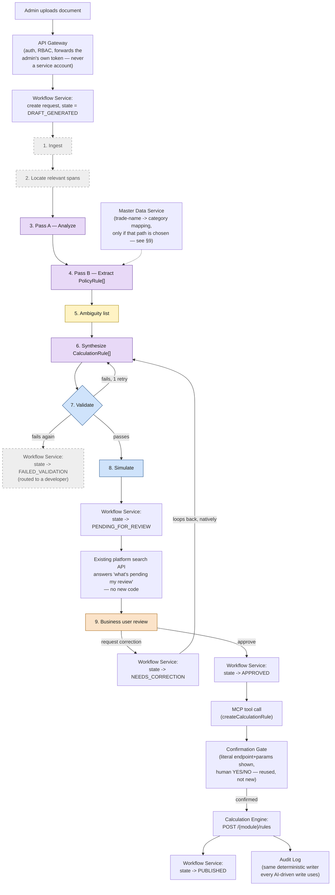
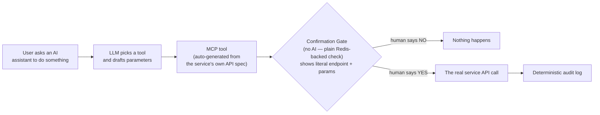
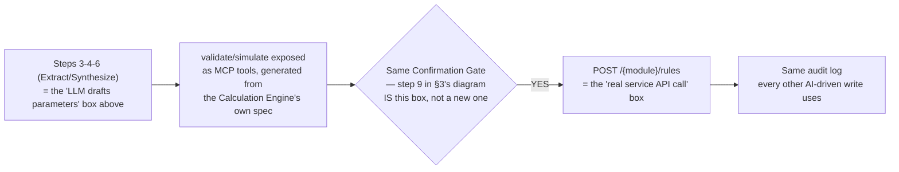
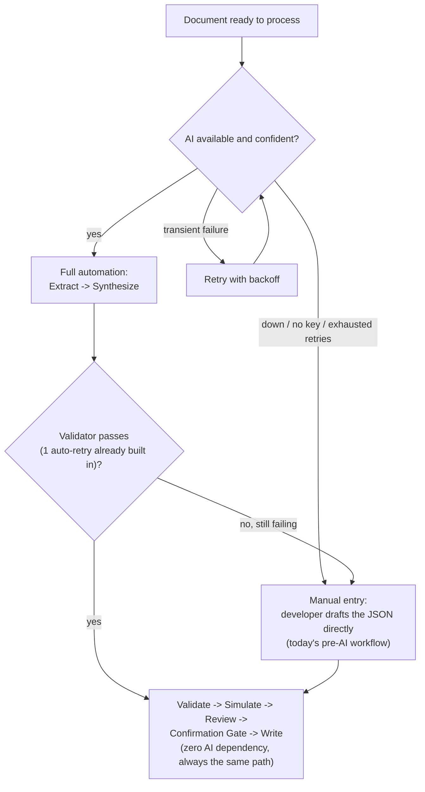

# Policy Doc → Calculation Engine Spec Generator — Demo & Architecture Review

## 1. Problem & goal

Today, turning a government fee policy (a notification, schedule, or filled-in requirements
form) into a working `CalculationRule` config for the DIGIT Calculation Engine requires a
developer to read the document, decide the rule structure, and hand-author JSON. The goal: let a
non-technical admin upload the policy document and get back (1) a generated, valid set of
`CalculationRule` specs, (2) the minimum number of clarifying questions — only for genuine
ambiguity, not a generic interview, and (3) a plain-language, worked-example demo ("a shop like
*this* pays *that*") so they can validate the spec without reading JSON.

## 2. Design principle

This is not "an LLM reads policy documents." A human developer doing this task performs several
cognitively distinct sub-tasks: understanding language and cross-referencing meaning, mapping
what they found onto a schema they already know, checking a draft against a fixed rulebook,
running the math to sanity-check it, and deciding whether an ambiguity is material enough to stop
and ask someone. The architecture matches each sub-task to the tool suited to it:

- **Understanding meaning, cross-referencing, mapping onto a known vocabulary** → an LLM.
- **Checking a draft against a fixed rulebook; running documented math** → plain deterministic
  code — this is bookkeeping, not judgment, and code is more reliable at it than an LLM or a human.
- **Deciding whether an ambiguity is material enough to require a human's sign-off** → an explicit
  human confirmation step, never fully automated away — it's a judgment about consequence (does
  guessing wrong change what a citizen is charged), and that judgment should stay with a person.

## 3. Architecture (as built for the demo)

```mermaid
flowchart TD
    DOC["Policy document<br/>(PDF/questionnaire/etc.)"] --> S1
    S1["1. Ingest<br/>PDF/table extraction"]:::notbuilt --> S2
    S2["2. Locate relevant spans<br/>find fee-relevant text,<br/>discard the rest"]:::notbuilt --> S3
    S3["3. Pass A — Analyze<br/>read the WHOLE document,<br/>cross-reference tables vs narrative,<br/>flag external references"]:::ai --> S4
    S4["4. Pass B — Extract<br/>guaranteed-valid PolicyRule[]<br/>(structured output)"]:::ai --> S5
    S5["5. Ambiguity list<br/>assumptions + confidence<br/>(flat list today — the designed<br/>3-tier split isn't built)"]:::partial --> S6
    S6["6. Synthesize<br/>PolicyRule[] → CalculationRule[]<br/>(structured output, grounded in<br/>the vocabulary reference)"]:::ai --> S7
    S7{"7. Validate<br/>checks the real schema's<br/>x-businessRules — no AI"}:::code
    S7 -->|fails, 1 retry| S6
    S7 -->|passes| S8
    S8["8. Simulate<br/>documented evaluation order,<br/>synthetic payloads — no AI"]:::code --> S9
    S9["9. Business user review<br/>plain-language rules + assumptions<br/>+ worked examples"]:::human
    S9 -->|correct it| S6
    S9 -->|approve| GATE
    GATE["Confirmation gate<br/>(show literal endpoint+params,<br/>human YES/NO)"]:::notbuilt --> WRITE
    WRITE["POST /{module}/rules<br/>on the real Calculation Engine<br/>+ audit log entry"]:::notbuilt

    classDef ai fill:#e8d9f7,stroke:#6a3fa0,color:#1a1a1a
    classDef code fill:#cfe3fb,stroke:#1b4d89,color:#1a1a1a
    classDef human fill:#fbe3c9,stroke:#a15b00,color:#1a1a1a
    classDef partial fill:#fff3c4,stroke:#a17f00,color:#1a1a1a
    classDef notbuilt fill:#eeeeee,stroke:#888888,color:#555555,stroke-dasharray: 5 5
```



Purple = sent to an LLM. Blue = plain code, zero AI. Orange = a human's judgment call.
Yellow = partially built. Grey/dashed = designed but not built.

Only 3 of these 9 steps actually call an LLM (Pass A analyze, Pass B extract, Synthesize) — the
rest are either plain deterministic code or not yet built.

## 4. Structured outputs, and why `PolicyRule[]` looks the way it does

**What "structured outputs" actually means:** instead of asking an LLM to "please return JSON" in
a prompt and writing repair logic for when it doesn't comply, both major providers' APIs support
passing an actual schema that the response is *constrained* to match at the API level — the model
literally cannot return a malformed shape. This removes an entire class of failure (parse errors,
missing fields, wrong types) before it can happen, rather than catching it after the fact. That's
the mechanism behind every purple ("sent to an LLM") box in §3's diagram.

**The actual shape**, as defined and sent to the API:

```python
class Band(BaseModel):
    from_: Optional[float]   # aliased to "from" — inclusive lower bound; omitted = unbounded below
    to: Optional[float]      # inclusive upper bound; omitted = unbounded above
    amount: float            # the fee for this band

class PolicyRule(BaseModel):
    scheduleId: str          # which section of the source document this came from
    tradeNames: list[str]    # every named item this pattern applies to
    conditionAttribute: str  # what the fee is banded on, or "none" for a flat fee
    suggestedJsonPath: str   # a guess at where this lives in a real payload — not authoritative yet
    bands: list[Band]
    sourceText: str          # verbatim quote — traceability back to the original document
    confidence: float        # 0-1, the model's own signal of how sure it is
```

Concretely, for the Chennai example in §5:

```json
{
  "scheduleId": "SCHEDULE-I-A",
  "tradeNames": ["Plastic works", "Tailoring Machine", "...47 total"],
  "conditionAttribute": "premisesArea",
  "suggestedJsonPath": "$.tradeLicenseDetail.premisesArea",
  "bands": [{"to": 1000, "amount": 2000}, {"from": 1000, "amount": 5000}],
  "sourceText": "Up to 1000 sq.ft. Rs.2000/- ; Above 1000 Sq.ft. Rs.5000/-",
  "confidence": 0.9
}
```

**Why this shape, specifically — every field earns its place:**

- **`scheduleId` + `sourceText`** — traceability. A reviewer (or a later debugging session) can
  always trace a generated rule back to the exact sentence it came from; without this, "why did it
  produce this number" has no answer.
- **`tradeNames` as a list, not a single value** — the direct answer to the *breadth* problem from
  the Chennai example: one pattern, many names, captured explicitly, rather than extraction
  silently picking one representative name and losing the other 46.
- **`conditionAttribute` + `suggestedJsonPath` + `bands`, kept separate and simple** — this is
  deliberately *not yet* the final `CalculationRule` shape (no `ruleType`, no `calculationType`, no
  schema-specific conditions object). It's a plain, schema-agnostic description of "what varies,
  and what it costs" — cheap for a human, or the next stage, to sanity-check, because a mistake
  here shows up in three plain fields, not buried inside a JSONPath-heavy nested object.
- **`confidence`** — not decorative. This is what actually dropped to 0.7 on the genuinely
  ambiguous Petrol Bunk/Service station case in §5 — a real, usable signal for the ambiguity-tiering
  step to act on, once it's built as more than a flat list.

**Why not skip this and extract straight to `CalculationRule` in one step:** exactly the reasoning
behind keeping extraction and synthesis as two separate stages in §3 — a wrong read of "above 1000
sq.ft." is visible and fixable in this small, plain structure, instead of being buried inside a
`RATE_MATRIX`/`FLAT` object with JSONPath conditions and priority fields already attached. Two
cheap-to-verify steps beat one hard-to-verify step.

## 5. Walkthrough — Chennai example (proven, real output)

**Document:** a formal municipal trade-licence fee notification. Schedule I: ~250 named trades
collapsed into a handful of fee patterns — hard because of *breadth*.

- **Pass A** reads the schedule and correctly groups 47 differently-named trades under one shared
  2-band fee (not 47 independent amounts), separately groups a different 34 trades under a 3-band
  fee, and correctly treats one item ("Petrol Bunk with Service station") as two independent
  fees, not a shared band. It also flags council-resolution citations it cannot resolve, and names
  the ambiguity: does "above 1000 sq.ft." mean strictly greater than, or 1000-and-up.
- **Pass B** turns that into structured `PolicyRule[]` — confidence dropped to 0.7 specifically on
  the ambiguous item, a real signal the model itself is less sure.
- **Synthesize** maps this onto two real `CalculationRule` records (`RATE_MATRIX`/`FLAT`, banded
  on `premisesArea`), resolving the boundary ambiguity into a concrete, non-overlapping number and
  recording that resolution as an assumption for a human to confirm or override.
- **Validate** (real run): *"All rules valid against calculation-engine-3.0.0.yaml's business
  rules."*
- **Simulate** (real run, three invented shops):
  ```
  Plastic works, 800 sq.ft.                          -> Total: Rs. 2000
  Tailoring Machine, exactly 1000 sq.ft. (boundary)   -> Total: Rs. 2000
  Automobile works, 1500 sq.ft.                       -> Total: Rs. 5000
  ```

Steps 7-8 above are genuinely proven — this is real code that ran and produced these exact
numbers, not a mock-up.

## 6. Walkthrough — Bissau example (illustrative, not yet run through the built code)

**Document:** a 14-page filled-in requirements questionnaire for a business-licence
digitalization effort — hard because of *needle-in-haystack*: only one page has fee numbers, the
rest is staffing, legal history, and process narrative.

- **Pass A** has to actively search past 13 irrelevant pages and find three small fee tables
  (rate per m², banded by area, split by inside-vs-outside-market for small stalls, a separate
  table for larger establishments), *and* cross-reference two scattered narrative sentences — "the
  fee is based on the area of the shop" and "there is no classification system for businesses" —
  which together establish that size and location are the *only* things that matter, not business
  type. That cross-referencing, done correctly, is the hard part this example demonstrates.
- No boundary ambiguity here (Bissau's bands are written cleanly, e.g. "1 to 5 square meters"),
  but the effective date and tenant scoping are still unstated and get flagged.
- **Honesty note:** this reasoning was demonstrated live, conversationally, and is a faithful
  preview of what Pass A/B should produce — it has not yet been run through the actual
  `extract.py`/`synthesize.py` code end to end. Treat Chennai as proven, Bissau as designed-for.

## 7. Why not a multi-agent design (e.g. one "policy" agent + one "calc-engine" agent)?

This was seriously considered and rejected, for concrete reasons, not by default:

1. **The control flow is fully known in advance** — extract, then synthesize, then validate, then
   simulate. Nothing here requires an agent to *decide* what to do next; a fixed sequence is more
   reliable and cheaper to run than letting a model improvise its own orchestration.
2. **The deterministic steps shouldn't be agentic at all.** Validation and simulation are
   exhaustive rule-checking and documented math — giving an "agent" freedom to reason about these
   adds risk (it could skip a check or hallucinate a rule) where plain code is strictly more
   reliable. These are tool calls, not another agent's judgment.
3. **A hard split between a "policy" agent and a "calc-engine" agent risks losing exactly the
   cross-referencing signal that matters.** Ambiguity detection often needs policy-language nuance
   and schema knowledge *at the same time* (e.g. "is this boundary ambiguity material enough to
   block, given what the schema requires?"). Two isolated agents would need to either duplicate
   context or lose it at the handoff.
4. **Two autonomous agents add coordination overhead — message-passing, retries, possible
   loops — with no reliability gain** over a two-call sequential pipeline for a task whose steps
   are already fully specified.
5. **Cost and latency**: each agent "thinking for itself" adds tokens and time without adding
   correctness when the steps themselves aren't in question.

The actual design keeps this as roles, not agents: an LLM role for the two understanding-heavy
calls, code for the two rulebook-checking calls, and a human for the one genuinely irreducible
judgment call — connected by a fixed pipeline, not a negotiation between autonomous agents.

## 8. Three proposed architectures

### A. Lean pipeline (current build; recommended for UAT / pilot stage)
Two-pass LLM extraction + synthesis, both via structured outputs (guaranteed-schema-conformant,
no hand-rolled JSON parsing) → deterministic validation → deterministic simulation. No agent
framework, no orchestration engine, no DIGIT dependency. Storage: a simple status table. Review:
a minimal screen (still to be built). **Cheapest to build, cheapest to run, easiest to debug** —
appropriate while stakes are "a tester notices a mistake in UAT," not "a citizen is overcharged."

### B. Multi-agent (considered, rejected — see §7)
A "policy understanding" agent and a "calculation engine" agent, each autonomous and
tool-calling, coordinating via message-passing. Rejected: unnecessary coordination overhead and
risk for a task whose steps don't need to be decided at runtime.

### C. DIGIT-native / production-integrated (recommended once this needs production guarantees)

Same core pipeline as (A) — nothing about the extract/synthesize/validate/simulate logic
changes. What changes is everything *around* it: instead of a plain status table and a script,
the admin's upload, the review/approval lifecycle, and the eventual write are each handled by an
existing platform service instead of custom code.

This is the full picture — every pipeline step from §3, not abstracted away, shown alongside
exactly which platform service wraps it:



Same color key as §3. Compare the two diagrams directly: everything purple/blue/orange/yellow in
the middle is completely unchanged from Architecture A — what's added is only the grey boxes
(workflow states, the gateway, MCP, the gate, the audit log).

**What each grey piece concretely adds — what specifically breaks without it:**

- **Workflow states.** Without this, when five documents get uploaded this week, there is no
  answer to "which ones are still processing, which are waiting for someone to review, which got
  approved" — except manually asking around. Someone would have to build a database table, write
  code to update its status, and write code to query it — a small custom system, reinvented, that
  the workflow service already does off the shelf, plus it already knows *who's allowed* to
  approve (RBAC) and *keeps every state change forever* (audit), neither of which a plain status
  column gives you for free.
- **API Gateway.** Without this, the pipeline itself would need to verify "is this really an
  authorized admin for this tenant, and are they allowed to do this" — security-critical code,
  written and maintained separately from every other service on the platform that already checks
  this the same way. Skipping it means either duplicating that logic (a place for it to be gotten
  wrong) or having no real check at all.
- **MCP.** This isn't required for the pipeline's core logic to run — validate/simulate/synthesize
  work as plain function calls regardless. What MCP specifically buys: the confirmation gate
  attaches automatically to anything called as an MCP tool, and any *other* AI-driven flow on the
  platform (a general admin assistant, say) can safely call "create a calculation rule" through
  the same governed path instead of this project needing to build its own separate
  confirm-then-write mechanism from scratch.
- **MDMS.** This is the direct fix for the specific "one rule, many trade names" gap named in
  earlier sections: the Calculation Engine can only condition on a single value or a numeric
  range, not "any of these 250 trade names." MDMS stores the mapping (`"Plastic works" →
  MICRO_COTTAGE`, and 249 more) once, so the incoming payload already carries a single
  `category = MICRO_COTTAGE` field looked up before the engine ever sees it — turning "250
  possible names" into the one value the schema already knows how to match on.

**What's genuinely new work here vs. reused:** the workflow's state/action config (new, but ~50
lines of config, not custom code — see the worked example in §9), the review screen (new, not
avoidable in any architecture), and the MDMS mapping (new, only if that path is chosen). The
gateway, the confirmation gate, MCP tooling, and the audit log are **existing platform
infrastructure, not built for this project** — this architecture's whole value proposition is
paying only for the new config, not rebuilding the plumbing around it.

**Only worth the setup cost once this handles real production billing — not for a UAT pilot**,
where Architecture A's plain status table does the same job for far less setup.

## 9. DIGIT services: where they genuinely help, and where they don't

**§8C explains what each service concretely adds and what breaks without it. This section is the
separate decision on top of that: given it *would* help, is it worth adding *right now*.** Those
are two different questions — a service can be a genuinely good fit in principle and still be the
wrong thing to build today, if the stakes don't yet justify its setup cost (see Architecture A vs.
C). The table below applies that test — "does this specific piece of the project need what this
service provides, at the current stage, not eventually" — to every candidate service, not just
the ones that make an easy case.

**Background finding this builds on:** an earlier internal proof (built for a different DIGIT
service, Public Grievance Redressal) already established that general-purpose automation/data-
integration tools are not stateful business-process engines — no persistent per-entity queryable
state, no loops without node duplication, no per-step RBAC, no SLA enforcement, short/configurable
audit retention far below government requirements.

| DIGIT service | Would it help this project? | Why / why not | When to actually add it |
|---|---|---|---|
| **Workflow service** (state machine, e.g. used for PGR) | Yes, but not yet | The review/approve/correct lifecycle (§8C) is structurally identical to a PGR-style process: states, a loop, RBAC on who can approve, a long audit trail. But UAT stakes don't require any of that yet. | Once this moves toward production billing — see Architecture C |
| **Master Data Service (MDMS)** | Yes, now | It's the literal mechanism named as one of two ways to close the trade-classification gap (§ open questions) — not a forced fit, an already-identified option | As soon as that classification path is chosen over extending the Calculation Engine's schema |
| **API Gateway** | Yes, always | Any real deployment needs auth/RBAC at the edge regardless of architecture — this isn't optional infrastructure, it's baseline | From day one of any real (non-local) deployment |
| **MCP tooling** | Yes, once there's a real service to protect | Turns validate/simulate (and the eventual real write) into governed, auditable tool calls instead of ad hoc function calls | Once this talks to a real Calculation Engine instance, not local JSON files |
| **Confirmation gate + audit log** | Yes, once writes are real | Same reasoning as MCP — there's nothing to gate or audit while output is just a local JSON file | Same trigger as MCP tooling |
| **ID-generation service** | Minor, optional | Gives proper request IDs instead of inventing an ad hoc scheme | Convenient anytime, not blocking |
| **Notification service** | Minor, optional | Pings a reviewer that something's waiting | Convenient anytime, not blocking |
| **A second orchestration engine** (on top of the workflow service) | **No** | Once the workflow service owns the wait/loop/state need, a second orchestrator on top is two systems doing the same job | Never, once Architecture C is in place |
| **MDMS for storing the actual `CalculationRule` specs** | **No** | That's the Calculation Engine's own job — MDMS is reference/master data, not transactional rule storage | Never — this would be the wrong abstraction, not a maturity question |
| **Workflow service on a deployment with no platform underneath it** | **No** | Forces a heavy platform dependency onto a context that may not have or want one (e.g. a lean standalone SaaS deployment) | Only if that deployment model is explicitly chosen — see open question on deployment model |

## 10. Where this fits the platform's broader AI architecture, and where MCP sits

**The existing pattern, in one picture** (how the platform's AI architecture already handles
*any* AI-driven write today, e.g. a chat interface creating a record):



**Where this project's pieces slot into that exact same picture:**



Nothing here is a new mechanism — the "business user review → approve" step from §3 *is* the
confirmation gate, using the same MCP/gate/audit-log machinery already built for every other
AI-driven write on the platform, not a parallel implementation.

**One genuine gap, worth naming plainly rather than glossing over:** everything built so far in
that existing architecture assumes a spec already exists, and AI only *consumes* it (picks the
right tool, fills in the right parameters). This project has AI *generate* a brand-new draft spec
from an unstructured document in the first place — the "LLM drafts parameters" box above is
normally a simple parameter-filling task; here it's the entire multi-step reasoning pipeline from
§3. That's a new capability class for this architecture, not a drop-in reuse of an existing
pattern — worth presenting as "the first of its kind," not "just another consumer."

## 11. Graceful degradation — this doesn't stop working if AI is down or wrong

**The core claim: only 2 of the 9 pipeline stages in §3 actually depend on AI at all (Pass A,
Pass B/Extract) plus one more that's AI-assisted but not AI-only (Synthesize).** Validate,
Simulate, Review, the Confirmation Gate, and the real write have zero AI dependency today —
`validate.py` and `simulate.py` are plain code that will check and run *any* `CalculationRule`
JSON handed to them, whether an LLM produced it or a person typed it by hand. AI is an optional
accelerator sitting in front of an already-AI-independent core — not something the rest of the
system collapses without.

**The degradation ladder, concretely:**

1. **AI available and confident** → full automation, steps 3-6 run as designed.
2. **AI available, but the deterministic validator rejects its draft twice** (the one automatic
   reflection retry already built into `synthesize.py` doesn't resolve it) → don't loop forever
   or fail silently. Surface the best-effort draft plus the validator's specific errors to a
   developer, who edits the JSON directly — still faster than drafting from a blank page, and
   this is already `synthesize.py`'s actual behavior today (it warns and returns rather than
   crashing).
3. **AI entirely unavailable** (API down, no key configured, sustained rate-limiting) → skip
   straight to manual entry of the `PolicyRule` or `CalculationRule` JSON at exactly the point
   Pass A/B/Synthesize would have produced it — i.e., exactly today's pre-AI developer workflow —
   and everything downstream (validate, simulate, review, gate, write) runs completely unchanged,
   because none of it was ever written to assume AI produced its input.
4. **Transient failures** (timeouts, momentary rate limits) → retry with backoff *before* falling
   back to step 3, so a brief blip doesn't force a manual detour unnecessarily.



**The honest gap:** this ladder is the *design* — the individual pieces (retry-then-fallback,
a manual-entry path) aren't wired together as an explicit, intentional degradation flow yet.
What's true today is narrower but still meaningful: the "spine" (validate/simulate/review/
gate/write) already works on any valid `CalculationRule` JSON regardless of its origin, which is
what makes this degradation path possible to build cheaply rather than a redesign.

## 12. LLM costs — estimated, not yet measured

**Caveat up front: every attempt to run this pipeline against a live API in this environment
failed on API-key issues, not on the pipeline itself — these are computed estimates from real
token counts in the actual prompts/fixtures, at current published pricing, not measured actuals.**
Before relying on these numbers, run the pipeline against a real key and record what it actually
costs.

Current pricing (as of this review): the default model in this build, a mid-tier flagship model,
runs roughly $2 input / $10 output per million tokens under introductory pricing (rising to
$3/$15 after an announced cutoff later this year); a comparable competing flagship model runs
$5/$30 (or as low as $1/$6 on a budget tier of the same family).

| Document | Est. input tokens (3 calls) | Est. output tokens | Est. cost per document |
|---|---|---|---|
| Chennai Schedule I (short, clean) | ~4,200 | ~1,050 | **~$0.02** |
| Bissau-style (long, needs cross-referencing) | ~11,600 | ~1,800 | **~$0.04** |
| Either, plus one validation-failure reflection retry | + ~2,000-3,000 | + ~400-600 | **+~$0.01-0.02** |

**Bottom line: single-digit cents per document at current pricing and the document sizes tested
so far.** Not a meaningful cost driver at UAT/pilot scale (tens to low hundreds of documents).
Becomes worth monitoring only at high volume (many thousands of documents/month) — and even then,
likely still smaller than the engineering cost of building the remaining pieces. Introductory
pricing on at least one provider is time-limited and will roughly increase 1.5x later this year —
worth re-checking before any cost commitment to a client.

## 13. Other practical concerns

- **Data privacy / hosting — and how to actually address it, not just flag it:**
  1. **Confirm a zero-data-retention agreement** with whichever LLM provider is used — both major
     providers offer enterprise terms where prompt/response content isn't retained beyond serving
     the request and isn't used for model training. This is a standard commercial agreement, not
     new engineering — the cheapest, fastest thing to actually close.
  2. **Send less.** Once "locate relevant spans" (§3, step 2) is built, only the fee-relevant span
     goes to the API, not the whole document — this shrinks exposure of anything unrelated and
     sensitive that a messy real-world document might contain (e.g. Bissau's questionnaire has
     staffing and internal-process detail nowhere near the fee tables).
  3. **If data residency is a hard regulatory requirement** for a given client (not yet confirmed
     either way), the fallback is a self-hosted open-weight model on the platform's own
     infrastructure instead of a third-party API — real infrastructure cost and very likely lower
     extraction quality than a frontier hosted model, so only worth it if (1) genuinely can't be
     satisfied.
  4. **The action item, concretely:** get an explicit data-processing agreement reviewed and
     signed off before any real (non-fixture) client document goes through this pipeline — this is
     a governance step to schedule, not a technical unknown to keep researching.
- **Vendor and pricing dependency.** Introductory pricing on at least one provider expires this
  year with a real, dated increase. Building in a provider-agnostic layer (already done in the
  prototype — either major provider's key works) reduces lock-in but doesn't remove the pricing
  risk itself.
- **API availability during a live review.** See §11 for the fallback design — the short version
  is that the deterministic spine doesn't depend on AI being up, but the retry/fallback ladder
  itself isn't wired together as a real, tested flow yet.
- **Prompt/schema drift.** As the Calculation Engine's schema gains new capabilities, the
  vocabulary reference and prompts need active upkeep — nothing currently detects if a prompt
  quietly stops matching the schema.
- **No regression benchmark yet.** There is currently no way to answer "did the last prompt
  change make extraction better or worse" with a number — everything demonstrated so far is two
  real documents, read carefully, not a repeatable, scored test set. Building that test set is
  real, separate work, not something that falls out of what exists today.
- **Multi-language documents untested — and the concrete way to close this, not just note it:**
  1. **Get one real non-English source document** (ideally an actual Portuguese-language document
     from the Guinea-Bissau context, not another English-language stand-in) and run it through
     Pass A/B exactly as built — this is a direct, cheap test, not a research project.
  2. Both major model families are trained on many languages and generally handle non-English
     input without a separate translation step — but that's a general capability claim, not
     something verified for *this specific task's prompts*, so treat it as untested until step 1
     is actually done, not assumed safe because the underlying model is "known to be multilingual."
  3. **Add one explicit instruction** to the Pass A/B/Synthesize prompts: produce the analysis,
     assumptions, and worked examples in a fixed output language (e.g. English) regardless of the
     source document's language — so every downstream step (validate, simulate, review) has a
     consistent language to work with even when the input doesn't.
  4. **Fallback, only if step 1 reveals a real gap:** a machine-translation preprocessing step
     before Pass A. Treat this as a documented contingency, not a default — likely unnecessary
     given current model capability, but cheap to keep in reserve.
- **Nothing has been run against a live API successfully in this review.** Every demonstrated
  extraction/synthesis output in this document came from either hand-authored fixtures or live
  conversational reasoning — not a completed automated run. This is the single most important
  thing to close before treating any of the above as fully proven.

## 14. Open questions for the team

1. **Trade-classification gap**: extend the Calculation Engine with a "matches any of these named
   values" condition operator, vs. push classification upstream into master data. Only matters for
   documents that enumerate specific named entities (like the Chennai trades), not for
   attribute/measurement-driven documents.
2. **Deployment model**: is the near-term target UAT-only with a lightweight standalone build
   (Architecture A), or does this need to sit on full platform infrastructure from the start
   (Architecture C)? This single decision determines most of the remaining build order.
3. **Data hosting/processing policy** for sending client policy documents to a third-party LLM API
   — needs an explicit decision, not an assumption.
4. **How much document-format diversity to promise** for a first real release — the two examples
   here span "clean formal notification" to "fee logic buried in a mostly-irrelevant document";
   untested formats (spreadsheets, scans, non-English source text) shouldn't be promised until
   tried.
5. **Priority of the two biggest built-vs-designed gaps**: the real ambiguity tiering (vs. today's
   flat assumptions list) and a real review screen (vs. today's script output) — both needed
   before a non-developer can operate this without a developer in the loop, even for the
   already-proven document pattern.
6. **When to invest in an actual evaluation benchmark** — a labeled test set plus a human-baseline
   comparison — rather than continuing to rely on a small number of hand-reviewed examples.
