# Policy Doc → Calculation Engine Spec Generator — Demo & Architecture Review

## 1. Problem & goal

Today, turning a government fee policy (a notification, schedule, or filled-in requirements
form) into a working `CalculationRule` config for the DIGIT Calculation Engine requires a
developer to read the document, decide the rule structure, and hand-author JSON. The goal: let a
non-technical admin upload the policy document and get back (1) a generated, valid set of
`CalculationRule` specs, (2) the minimum number of clarifying questions — only for genuine
ambiguity, not a generic interview, and (3) a plain-language, worked-example demo ("a shop like
*this* pays *that*") so they can validate the spec without reading JSON.

## 2. Design principle

This is not "an LLM reads policy documents." A human developer doing this task performs several
cognitively distinct sub-tasks: understanding language and cross-referencing meaning, mapping
what they found onto a schema they already know, checking a draft against a fixed rulebook,
running the math to sanity-check it, and deciding whether an ambiguity is material enough to stop
and ask someone. The architecture matches each sub-task to the tool suited to it:

- **Understanding meaning, cross-referencing, mapping onto a known vocabulary** → an LLM.
- **Checking a draft against a fixed rulebook; running documented math** → plain deterministic
  code — this is bookkeeping, not judgment, and code is more reliable at it than an LLM or a human.
- **Deciding whether an ambiguity is material enough to require a human's sign-off** → an explicit
  human confirmation step, never fully automated away — it's a judgment about consequence (does
  guessing wrong change what a citizen is charged), and that judgment should stay with a person.

## 3. Architecture (as built for the demo)

```mermaid
flowchart TD
    DOC["Policy document<br/>(PDF/questionnaire/etc.)"] --> S1
    S1["1. Ingest<br/>PDF/table extraction"]:::notbuilt --> S2
    S2["2. Locate relevant spans<br/>find fee-relevant text,<br/>discard the rest"]:::notbuilt --> S3
    S3["3. Pass A — Analyze<br/>read the WHOLE document,<br/>cross-reference tables vs narrative,<br/>flag external references"]:::ai --> S4
    S4["4. Pass B — Extract<br/>guaranteed-valid PolicyRule[]<br/>(structured output)"]:::ai --> S5
    S5["5. Ambiguity list<br/>assumptions + confidence<br/>(flat list today — the designed<br/>3-tier split isn't built)"]:::partial --> S6
    S6["6. Synthesize<br/>PolicyRule[] → CalculationRule[]<br/>(structured output, grounded in<br/>the vocabulary reference)"]:::ai --> S7
    S7{"7. Validate<br/>checks the real schema's<br/>x-businessRules — no AI"}:::code
    S7 -->|fails, 1 retry| S6
    S7 -->|passes| S8
    S8["8. Simulate<br/>documented evaluation order,<br/>synthetic payloads — no AI"]:::code --> S9
    S9["9. Business user review<br/>plain-language rules + assumptions<br/>+ worked examples"]:::human
    S9 -->|correct it| S6
    S9 -->|approve| GATE
    GATE["Confirmation gate<br/>(show literal endpoint+params,<br/>human YES/NO)"]:::notbuilt --> WRITE
    WRITE["POST /{module}/rules<br/>on the real Calculation Engine<br/>+ audit log entry"]:::notbuilt

    classDef ai fill:#e8d9f7,stroke:#6a3fa0,color:#1a1a1a
    classDef code fill:#cfe3fb,stroke:#1b4d89,color:#1a1a1a
    classDef human fill:#fbe3c9,stroke:#a15b00,color:#1a1a1a
    classDef partial fill:#fff3c4,stroke:#a17f00,color:#1a1a1a
    classDef notbuilt fill:#eeeeee,stroke:#888888,color:#555555,stroke-dasharray: 5 5
```



Purple = sent to an LLM. Blue = plain code, zero AI. Orange = a human's judgment call.
Yellow = partially built. Grey/dashed = designed but not built.

Only 3 of these 9 steps actually call an LLM (Pass A analyze, Pass B extract, Synthesize) — the
rest are either plain deterministic code or not yet built.

## 4. Walkthrough — Chennai example (proven, real output)

**Document:** a formal municipal trade-licence fee notification. Schedule I: ~250 named trades
collapsed into a handful of fee patterns — hard because of *breadth*.

- **Pass A** reads the schedule and correctly groups 47 differently-named trades under one shared
  2-band fee (not 47 independent amounts), separately groups a different 34 trades under a 3-band
  fee, and correctly treats one item ("Petrol Bunk with Service station") as two independent
  fees, not a shared band. It also flags council-resolution citations it cannot resolve, and names
  the ambiguity: does "above 1000 sq.ft." mean strictly greater than, or 1000-and-up.
- **Pass B** turns that into structured `PolicyRule[]` — confidence dropped to 0.7 specifically on
  the ambiguous item, a real signal the model itself is less sure.
- **Synthesize** maps this onto two real `CalculationRule` records (`RATE_MATRIX`/`FLAT`, banded
  on `premisesArea`), resolving the boundary ambiguity into a concrete, non-overlapping number and
  recording that resolution as an assumption for a human to confirm or override.
- **Validate** (real run): *"All rules valid against calculation-engine-3.0.0.yaml's business
  rules."*
- **Simulate** (real run, three invented shops):
  ```
  Plastic works, 800 sq.ft.                          -> Total: Rs. 2000
  Tailoring Machine, exactly 1000 sq.ft. (boundary)   -> Total: Rs. 2000
  Automobile works, 1500 sq.ft.                       -> Total: Rs. 5000
  ```

Steps 7-8 above are genuinely proven — this is real code that ran and produced these exact
numbers, not a mock-up.

## 5. Walkthrough — Bissau example (illustrative, not yet run through the built code)

**Document:** a 14-page filled-in requirements questionnaire for a business-licence
digitalization effort — hard because of *needle-in-haystack*: only one page has fee numbers, the
rest is staffing, legal history, and process narrative.

- **Pass A** has to actively search past 13 irrelevant pages and find three small fee tables
  (rate per m², banded by area, split by inside-vs-outside-market for small stalls, a separate
  table for larger establishments), *and* cross-reference two scattered narrative sentences — "the
  fee is based on the area of the shop" and "there is no classification system for businesses" —
  which together establish that size and location are the *only* things that matter, not business
  type. That cross-referencing, done correctly, is the hard part this example demonstrates.
- No boundary ambiguity here (Bissau's bands are written cleanly, e.g. "1 to 5 square meters"),
  but the effective date and tenant scoping are still unstated and get flagged.
- **Honesty note:** this reasoning was demonstrated live, conversationally, and is a faithful
  preview of what Pass A/B should produce — it has not yet been run through the actual
  `extract.py`/`synthesize.py` code end to end. Treat Chennai as proven, Bissau as designed-for.

## 6. Why not a multi-agent design (e.g. one "policy" agent + one "calc-engine" agent)?

This was seriously considered and rejected, for concrete reasons, not by default:

1. **The control flow is fully known in advance** — extract, then synthesize, then validate, then
   simulate. Nothing here requires an agent to *decide* what to do next; a fixed sequence is more
   reliable and cheaper to run than letting a model improvise its own orchestration.
2. **The deterministic steps shouldn't be agentic at all.** Validation and simulation are
   exhaustive rule-checking and documented math — giving an "agent" freedom to reason about these
   adds risk (it could skip a check or hallucinate a rule) where plain code is strictly more
   reliable. These are tool calls, not another agent's judgment.
3. **A hard split between a "policy" agent and a "calc-engine" agent risks losing exactly the
   cross-referencing signal that matters.** Ambiguity detection often needs policy-language nuance
   and schema knowledge *at the same time* (e.g. "is this boundary ambiguity material enough to
   block, given what the schema requires?"). Two isolated agents would need to either duplicate
   context or lose it at the handoff.
4. **Two autonomous agents add coordination overhead — message-passing, retries, possible
   loops — with no reliability gain** over a two-call sequential pipeline for a task whose steps
   are already fully specified.
5. **Cost and latency**: each agent "thinking for itself" adds tokens and time without adding
   correctness when the steps themselves aren't in question.

The actual design keeps this as roles, not agents: an LLM role for the two understanding-heavy
calls, code for the two rulebook-checking calls, and a human for the one genuinely irreducible
judgment call — connected by a fixed pipeline, not a negotiation between autonomous agents.

## 7. Three proposed architectures

### A. Lean pipeline (current build; recommended for UAT / pilot stage)
Two-pass LLM extraction + synthesis, both via structured outputs (guaranteed-schema-conformant,
no hand-rolled JSON parsing) → deterministic validation → deterministic simulation. No agent
framework, no orchestration engine, no DIGIT dependency. Storage: a simple status table. Review:
a minimal screen (still to be built). **Cheapest to build, cheapest to run, easiest to debug** —
appropriate while stakes are "a tester notices a mistake in UAT," not "a citizen is overcharged."

### B. Multi-agent (considered, rejected — see §6)
A "policy understanding" agent and a "calculation engine" agent, each autonomous and
tool-calling, coordinating via message-passing. Rejected: unnecessary coordination overhead and
risk for a task whose steps don't need to be decided at runtime.

### C. DIGIT-native / production-integrated (recommended once this needs production guarantees)
Same core pipeline as (A), wrapped with: the platform's own workflow service for the
review/approval lifecycle (persistent, queryable, RBAC'd state; the human-correction loop modeled
as a native cycle, e.g. a state like `NEEDS_CORRECTION` looping back to `PENDING_FOR_REVIEW`);
master-data service for trade/category classification (if that path is chosen over extending the
Calculation Engine's condition schema — see §9); the platform's API gateway for token-forwarded
auth; MCP wrapping the validate/simulate (and possibly extract/synthesize) steps as tools; the
platform's existing AI confirmation-gate and audit-log pattern reused rather than reinvented.
**Only worth the setup cost once this handles real production billing — not for a UAT pilot.**

## 8. DIGIT services: where they genuinely help, and where they don't

An earlier internal proof (built for a different DIGIT service, Public Grievance Redressal)
already established that general-purpose automation/data-integration tools are not stateful
business-process engines — no persistent per-entity queryable state, no loops without node
duplication, no per-step RBAC, no SLA enforcement, short/configurable audit retention far below
government requirements. That same reasoning applies here, honestly, in both directions:

- **Helps, and not a stretch:** the platform's own workflow service, *if and only if* this is
  deployed on top of existing platform infrastructure and needs production-grade RBAC/audit — see
  Architecture C. **Does not help right now**, given the pilot stage is UAT — the setup cost buys
  guarantees UAT doesn't need yet, and a plain status table is the honest right-sized choice today.
- **Genuinely helps:** the platform's master-data service, for the trade-name → category mapping
  discussed in §9 — this is the literal mechanism one of the two schema-gap resolution options
  already names, not a forced fit.
- **Minor, optional fits:** the platform's ID-generation service (proper request IDs) and
  notification service (alerting a reviewer) — convenient, not load-bearing.
- **Explicitly not needed:** a separate long-running workflow orchestration engine for the
  human-wait/loop step — once the platform's own workflow service is in the picture (Architecture
  C), adding a second orchestration engine on top would just be two systems doing the same job.
- **Explicitly not a fit regardless of stage:** forcing the master-data service to store the
  actual `CalculationRule` specs themselves (that's the Calculation Engine's job, not reference
  data), and forcing the workflow service onto a deployment that doesn't already run the platform
  underneath it.

## 9. Where this fits the platform's broader AI architecture, and where MCP sits

The platform's existing AI architecture vision (documented separately) is built around: an MCP
tool layer auto-generated from each service's own API spec, a lightweight non-AI confirmation
gate intercepting every write (Redis-backed, shows the literal endpoint+params, human YES/NO), a
deterministic audit log, and an orchestration engine used only as a sequencer over the same tools
the interactive path already calls — never a second write path. Retrieval-augmented generation in
that architecture is scoped to documentation Q&A only, and doesn't apply here.

This project fits that pattern on three axes directly: the deterministic validate/simulate steps
should be exposed as MCP tools generated from the Calculation Engine's own spec, the same
naming/mutation-detection conventions already in use elsewhere; the "business user review →
approve" step (§3, step 9) is exactly the confirmation-gate's shape — AI proposes, a human
confirms, only then does a write happen; and every confirmed write should land in the same
audit log the rest of the platform's AI-driven writes use, not a bespoke one.

**One thing this project is not** yet covered by existing precedent for: everything built so far
in that architecture assumes specs already exist and AI only *consumes* them as tools. This
project has AI *generate* a draft spec from an unstructured document in the first place — a new
capability class for that architecture, not a straightforward reuse of an existing pattern. Worth
naming explicitly rather than presenting as "just another consumer of existing infrastructure."

## 10. LLM costs — estimated, not yet measured

**Caveat up front: every attempt to run this pipeline against a live API in this environment
failed on API-key issues, not on the pipeline itself — these are computed estimates from real
token counts in the actual prompts/fixtures, at current published pricing, not measured actuals.**
Before relying on these numbers, run the pipeline against a real key and record what it actually
costs.

Current pricing (as of this review): the default model in this build, a mid-tier flagship model,
runs roughly $2 input / $10 output per million tokens under introductory pricing (rising to
$3/$15 after an announced cutoff later this year); a comparable competing flagship model runs
$5/$30 (or as low as $1/$6 on a budget tier of the same family).

| Document | Est. input tokens (3 calls) | Est. output tokens | Est. cost per document |
|---|---|---|---|
| Chennai Schedule I (short, clean) | ~4,200 | ~1,050 | **~$0.02** |
| Bissau-style (long, needs cross-referencing) | ~11,600 | ~1,800 | **~$0.04** |
| Either, plus one validation-failure reflection retry | + ~2,000-3,000 | + ~400-600 | **+~$0.01-0.02** |

**Bottom line: single-digit cents per document at current pricing and the document sizes tested
so far.** Not a meaningful cost driver at UAT/pilot scale (tens to low hundreds of documents).
Becomes worth monitoring only at high volume (many thousands of documents/month) — and even then,
likely still smaller than the engineering cost of building the remaining pieces. Introductory
pricing on at least one provider is time-limited and will roughly increase 1.5x later this year —
worth re-checking before any cost commitment to a client.

## 11. Other practical concerns

- **Data privacy / hosting.** Policy documents leave the platform's own environment and go to a
  third-party LLM API. For government fee schedules this is probably low-sensitivity, but this
  hasn't been decided as policy — worth an explicit call on data residency/processing terms before
  this handles real client documents, not an assumption.
- **Vendor and pricing dependency.** Introductory pricing on at least one provider expires this
  year with a real, dated increase. Building in a provider-agnostic layer (already done in the
  prototype — either major provider's key works) reduces lock-in but doesn't remove the pricing
  risk itself.
- **API availability during a live review.** No built-in handling yet for what a reviewer sees if
  the LLM API is down or rate-limited mid-session — worth a defined fallback (queue and retry
  later, not a hard failure) before this is client-facing.
- **Prompt/schema drift.** As the Calculation Engine's schema gains new capabilities, the
  vocabulary reference and prompts need active upkeep — nothing currently detects if a prompt
  quietly stops matching the schema.
- **No regression benchmark yet.** There is currently no way to answer "did the last prompt
  change make extraction better or worse" with a number — everything demonstrated so far is two
  real documents, read carefully, not a repeatable, scored test set. Building that test set is
  real, separate work, not something that falls out of what exists today.
- **Multi-language documents untested.** The Chennai source had a Tamil legal preamble (stripped
  before use here); genuine non-English source documents from other geographies haven't been
  tested at all.
- **Nothing has been run against a live API successfully in this review.** Every demonstrated
  extraction/synthesis output in this document came from either hand-authored fixtures or live
  conversational reasoning — not a completed automated run. This is the single most important
  thing to close before treating any of the above as fully proven.

## 12. Open questions for the team

1. **Trade-classification gap**: extend the Calculation Engine with a "matches any of these named
   values" condition operator, vs. push classification upstream into master data. Only matters for
   documents that enumerate specific named entities (like the Chennai trades), not for
   attribute/measurement-driven documents.
2. **Deployment model**: is the near-term target UAT-only with a lightweight standalone build
   (Architecture A), or does this need to sit on full platform infrastructure from the start
   (Architecture C)? This single decision determines most of the remaining build order.
3. **Data hosting/processing policy** for sending client policy documents to a third-party LLM API
   — needs an explicit decision, not an assumption.
4. **How much document-format diversity to promise** for a first real release — the two examples
   here span "clean formal notification" to "fee logic buried in a mostly-irrelevant document";
   untested formats (spreadsheets, scans, non-English source text) shouldn't be promised until
   tried.
5. **Priority of the two biggest built-vs-designed gaps**: the real ambiguity tiering (vs. today's
   flat assumptions list) and a real review screen (vs. today's script output) — both needed
   before a non-developer can operate this without a developer in the loop, even for the
   already-proven document pattern.
6. **When to invest in an actual evaluation benchmark** — a labeled test set plus a human-baseline
   comparison — rather than continuing to rely on a small number of hand-reviewed examples.
