# Policy Doc → Calculation Engine Spec Generator — Design

## Problem

Today, turning a government fee policy (a notification, schedule, or circular) into a working
`CalculationRule` config for the [Calculation Engine](../../Downloads/calculation-engine-3.0.0.yaml)
requires a developer to read the document, decide the rule structure, and hand-author JSON.
Goal: let a business user upload the policy document and get back:

1. A generated, valid set of `CalculationRule` specs (per the Calculation Engine's OpenAPI schema).
2. The **minimum** number of clarifying questions — only for genuine ambiguity or missing
   legally-material facts, not a generic requirements interview.
3. A synthetic-payload demo — plain-language "if a shop looks like *this*, the fee is *that*"
   examples, so the business user can validate the spec without reading JSON or JSONPath.

## Design principle

This is not "an LLM reads policy documents." A human developer turning a policy document into a
`CalculationRule` config performs several cognitively distinct sub-tasks: understanding language
and cross-referencing meaning across a document, mapping what they found onto a target schema they
already know, checking a draft against a fixed rulebook, running the math to sanity-check it, and
deciding whether an ambiguity is material enough to stop and ask someone. These are different
*kinds* of task, and the architecture matches each one to the tool actually suited to it —
it does not ask one model to do all of them:

- **Understanding meaning, cross-referencing, mapping onto a known vocabulary** → an LLM (Stages
  2 and 4). This is where language models are genuinely strong.
- **Checking a draft against a fixed, exhaustive rulebook; running documented math** → plain
  deterministic code (Stages 4's validation, and Stage 5). This is *not* a judgment task — it's
  bookkeeping, and code is more reliable at exhaustive bookkeeping than either a human or an LLM.
- **Deciding whether an ambiguity is material enough to require a human's sign-off** → an explicit
  human confirmation step (Stages 3 and 6), not something to automate away. This is a judgment
  about consequence — does guessing wrong here change what a citizen gets charged — and that
  judgment should stay with a person, not be quietly delegated to a model's confidence score.

The full mapping from "what a human does" to "what each stage does" is laid out after the pipeline
below — that mapping, not "we used an LLM," is the actual design.

## Worked examples

A single clean gazette table would understate the problem. Two documents anchor this design
specifically because they fail in different ways — the generator has to handle both, not just
whichever is easiest:

### Example A: Chennai Corporation trade licence fee schedule (`core zone4 5 6 8 9 10 13.pdf`)

Well-formatted, single-purpose legal notification. Six schedules, each listing many trade names
that share one fee structure. The hard part here is **breadth**: ~250 named trades collapsed into
~6 fee patterns.

| Schedule | Pattern | Calc Engine shape |
|---|---|---|
| I (Micro Cottage, 30 trades) | Flat by area: ≤1000 sq.ft → 2000, >1000 → 5000 | `RATE_MATRIX`, `FLAT`, condition on area |
| I, item 48 (18 trades) | 3-band flat by area: ≤500 → 500, 501–1000 → 750, >1000 → 5000 | same shape, 3 bands |
| I, item 82 | Two *different* trades, each its own flat fee (Petrol Bunk 6000, Service station 3000) | two separate `RATE_MATRIX`/`FLAT` rules, no shared band |
| II (40 trades) | Single flat fee, no banding | `RATE_MATRIX`, `FLAT`, no conditions (or a category condition only) |
| III, IV (37 trades) | Flat, or 2-band by area | same shapes as above |
| V, item 82-equivalent (Hair cutting saloon) | Banded by a boolean/category (A.C. vs non-A.C.), not area | `RATE_MATRIX`, condition on an `equals` attribute other than area |

### Example B: Bissau City Council (CMB) business-licence fee schedule

Source: `Business Registry and Business License Requirement Gathering Questionnaire FV_edh_.pdf`
— a filled-in requirement-gathering questionnaire found online by the product team as an
illustrative sample of the kind of document this pilot deals with. **Not confirmed as the actual
client-supplied policy document** — the real one, when it arrives, is expected to be an iteration
of this with more rule complexity, particularly rebates/adjustments (see coverage gap below). It's
still useful as a worked example for two reasons: (1) it plausibly resembles the real document's
shape (a council-published area-based fee schedule), and (2) it's a genuinely different document
*format* from Example A — a filled-in requirement-gathering questionnaire, not a purpose-written
notification — which is the harder, more general case worth designing for regardless of whether
this exact content turns out to be the final input. The hard part here is the opposite of Example
A: **needle-in-haystack**, not breadth.

- The document is 14 pages of Q&A covering legal framework, stakeholders, staffing, collections,
  digital literacy — almost none of it calculation-relevant.
- The actual fee logic is three small tables on one page (Q18/Q19), plus a one-line narrative
  confirmation elsewhere in the doc ("calculated by the coverage area of the commercial
  establishment... there is no classification system for commercial establishments") that must be
  cross-referenced against the tables to confirm area is the *only* rate-driving attribute.
- Fee shape: **rate per m², itself banded by total area**, split by a `locationType` axis
  (inside vs. outside the market) for one establishment category, and a separate flat-banded table
  for a second category (shops/warehouses/bars/hotels/etc.):

| Table | conditions | calculationType |
|---|---|---|
| Market-area kiosks/lockers/containers | `locationType: MARKET`, `area` band (1–5, 6–10, 11–20, 21–30, 30+ m²) | `RATE_MATRIX`, `PER_UNIT`, value = rate for that band, `appliesOn.jsonPath: area` |
| Outside-market kiosks/lockers/containers | `locationType: OUTSIDE_MARKET`, same area bands, different rates | same shape, second rule set |
| Other establishments (shops, bars, hotels, etc.) | `establishmentType: OTHER`, area bands 15–25…55+ m² | same shape, third rule set, no `locationType` condition |

Unlike Example A, this needs **no schema extension** — it's `RATE_MATRIX`/`PER_UNIT` with two
ANDed conditions (Tier 4/7 in the vocabulary reference below), because the rate-driving attribute
is a continuous measurement (area) plus a small enumerated axis (location), never a named-entity
list. This is the useful negative result: the "many trade names" gap below is **not universal** —
it only bites when the policy enumerates specific named entities (trades, item types) rather than
physical attributes.

**Together these confirm the target shape is already well-supported** (`RATE_MATRIX` with `FLAT`
or `PER_UNIT`, conditions keyed by one or more attributes with `from`/`to` or `equals`) for both a
clean formal notification and a messy, mostly-irrelevant requirements document — *except* for one
structural gap, below, which is specific to Example A's shape.

### Coverage gap in the current worked examples

Both Example A and Example B happen to be pure `RATE_MATRIX` (`FLAT`/`PER_UNIT`) documents —
neither exercises `ADJUSTMENT` (rebates), `TAX` stacking (`appliesOn.componentRef` + `dependsOn`),
`AGGREGATION`, `SLAB`, or `FORMULA`. Since the real policy document is expected to be "an
iteration of [Example B] with maybe more rebate and policy rules," the parts of the pipeline that
haven't actually been stress-tested yet are: extracting a rebate/exemption clause into a
`PolicyRule` that becomes an `ADJUSTMENT` rule (schema requires `appliesOn.componentRef` on every
`ADJUSTMENT`, per `calculation-engine-3.0.0.yaml`'s `x-businessRules` — see
`reference/calculation-rule-vocabulary.md`), and correctly building the `dependsOn` chain when a
rebate/tax reads another rule's output. Treat the current design as validated for flat/banded base
fees only, until a third worked example (real or constructed) exercises a rebate.

## Open schema gap: "one rule, many trade names" (Example A only)

Every Chennai schedule expresses **one fee pattern shared by dozens of trade names**. Verified
directly against the schema, not just inferred from examples: `components/schemas/AttributeCondition`
in `calculation-engine-3.0.0.yaml` only defines `jsonPath` + (`equals` **or** `from`/`to`, mutually
exclusive per its `x-businessRules`) + `derivedFrom`. There is no array/list-valued match operator
anywhere in the schema — no "trade name is one of these 250" (`in`). Example B needed no such
thing, since its conditions are all physical/enumerated axes, not named-entity lists — so this gap
only matters for policy documents that classify by a large, specific vocabulary (trade names,
product categories) rather than by measurement.

Two ways to close this gap, and this is a real product decision, not something to infer:

- **(a) Add an `in: [...]` condition operator** to the engine — one `RATE_MATRIX` rule per
  schedule/band, condition `tradeName: { in: [72 values] }`. Minimal rule count, but changes the
  Calculation Engine API itself.
- **(b) Push classification upstream** — assume the caller's payload already carries a
  normalized `tradeCategory`/`scheduleCode` attribute (e.g. resolved from DIGIT MDMS trade-type
  master data before calling `/estimate`), and condition on that single value instead of raw
  trade name. No engine change, but requires a trade-name → schedule-code MDMS mapping to exist
  or be generated as a side artifact.

This should be flagged to Ghanshyam as a decision before building the rule-synthesis step — it
determines whether the generator also needs to emit an MDMS mapping artifact alongside the rules.
Recommendation: **(b)**, since it keeps the Calculation Engine generic (per its own design
principle of not hardcoding module vocabulary) and the mapping table is a natural byproduct of
the extraction step anyway (see Stage 2 below).

## Pipeline

Color key: **purple = sent to an LLM**, **blue = plain deterministic code, zero AI**, **orange =
a human's judgment call**, **dashed/grey = designed but not built**.

```mermaid
flowchart TD
    DOC["Policy document<br/>(PDF/questionnaire/etc.)"] --> S1

    S1["1. Ingest<br/>PDF/table extraction"]:::notbuilt --> S2
    S2["2. Locate relevant spans<br/>find the fee-relevant text,<br/>discard the rest"]:::notbuilt --> S3

    S3["3. Pass A — Analyze<br/>read the WHOLE document,<br/>cross-reference tables vs narrative,<br/>flag external references"]:::ai --> S4
    S4["4. Pass B — Extract<br/>guaranteed-valid PolicyRule[]<br/>(structured output)"]:::ai --> S5

    S5["5. Ambiguity list<br/>assumptions + confidence<br/>(flat list today — the designed<br/>3-tier split isn't built)"]:::partial --> S6

    S6["6. Synthesize<br/>PolicyRule[] → CalculationRule[]<br/>(structured output, grounded in<br/>the vocabulary reference)"]:::ai --> S7

    S7{"7. Validate<br/>checks the real schema's<br/>x-businessRules — no AI"}:::code
    S7 -->|fails, 1 retry| S6
    S7 -->|passes| S8

    S8["8. Simulate<br/>documented evaluation order,<br/>synthetic payloads — no AI"]:::code --> S9

    S9["9. Business user review<br/>plain-language rules + assumptions<br/>+ worked examples"]:::human
    S9 -->|correct it| S6
    S9 -->|approve| GATE

    GATE["Confirmation gate<br/>(AI-fying-DIGIT pattern:<br/>show literal endpoint+params,<br/>human YES/NO)"]:::notbuilt --> WRITE
    WRITE["POST /{module}/rules<br/>on the real Calculation Engine<br/>+ audit log entry"]:::notbuilt

    classDef ai fill:#e8d9f7,stroke:#6a3fa0,color:#1a1a1a
    classDef code fill:#cfe3fb,stroke:#1b4d89,color:#1a1a1a
    classDef human fill:#fbe3c9,stroke:#a15b00,color:#1a1a1a
    classDef partial fill:#fff3c4,stroke:#a17f00,color:#1a1a1a
    classDef notbuilt fill:#eeeeee,stroke:#888888,color:#555555,stroke-dasharray: 5 5
```



Note the two loops: Step 7 can send work back to Step 6 automatically (one bounded retry, no
human involved — the reflection-guardrail pattern). Step 9 sending work back to Step 6 is a
*human's* correction — that loop is designed but the confirmation UI it depends on isn't built.

### 1. Ingest
- PDF/table extraction. Example A is a scanned/typeset table, bilingual Tamil+English — table
  structure is the reliable signal, not prose; OCR quality on the Tamil preamble is irrelevant,
  the preamble is boilerplate legal citation, not rule content.
- **Locate relevant spans (required for documents like Example B):** most real-world inputs will
  not be purpose-written fee notifications — they'll be long, mixed-purpose documents (a
  requirements questionnaire, an MDMS onboarding form, a council meeting minutes excerpt) where
  the actual fee logic is a small fraction of the content. Before extraction runs, a
  retrieval/classification pass over the whole document flags candidate spans (tables *and*
  narrative sentences that describe a rate, e.g. "calculated by the coverage area of the
  establishment"), and discards the rest (legal framework, staffing, process narrative). Without
  this step, Example B's three fee tables on page 7 are indistinguishable from 13 pages of noise
  to a naive "extract every table" pass, and a narrative confirmation like "there is no
  classification system for commercial establishments" (page 12) — which matters, because it
  rules out a trade-type condition entirely — would never reach the extraction stage at all.
- Output: raw candidate tables/spans (source name, row list or sentence, fee-relevant confidence),
  discarding everything below a relevance threshold.

### 2. Extract & Normalize
- LLM pass converts each schedule into an intermediate **PolicyRule** representation (not yet
  the final API schema) — deliberately a simpler shape so extraction errors are cheap to spot:

```json
{
  "scheduleId": "SCHEDULE-I",
  "tradeNames": ["Plastic works", "Tailoring Machine", "..."],
  "conditionAttribute": "premisesArea",
  "bands": [
    {"to": 1000, "amount": 2000},
    {"from": 1000, "amount": 5000}
  ],
  "sourceText": "Up to 1000 sq.ft. Rs.2000/- ; Above 1000 Sq.ft. Rs.5000/-"
}
```
- Also emits the **tradeName → scheduleId** mapping as a byproduct (feeds the MDMS decision above).
- Every extracted field keeps a confidence score and the verbatim source span, for Stage 3.

### 3. Ambiguity Detection — the "minimum questions" gate
Only surface a question when it is **materially ambiguous** (changes the computed amount or
blocks a required schema field) — everything else becomes a stated, batched-for-confirmation
assumption. Concretely, three tiers:

- **Auto-resolve, no mention:** cosmetic normalization (trade name casing, whitespace, "Mfg." →
  "Manufacturing" for display) — never surfaced.
- **Auto-resolve, shown as an assumption to confirm in one batch at the end:** things with a
  sane, stated default — e.g. "Above 1000 sq.ft." interpreted as `> 1000` not `≥ 1000`; missing
  `effectiveFrom` defaulted to the document's issue date; `roundOff` defaulted to `NEAREST_1`.
  Business user sees a single "here's what I assumed" screen and can flip any of them.
- **Blocking question, asked explicitly:** genuinely missing/contradictory legally-material
  facts the document doesn't state at all — e.g. this document has no `tenantId`/ULB code,
  no explicit `effectiveFrom` date for the *whole* notification, and item 82 (Petrol Bunk) reads
  ambiguously as to whether it's one combined licence or two separately payable fees. These block
  because guessing wrong silently changes what a citizen is charged.

Target: for a document like this one, roughly 3-5 blocking questions total (tenant/ULB, notification
effective date, and 1-2 genuine structural ambiguities), not one question per trade name or per
schedule.

### 4. Rule Synthesis & Validation
- Map each `PolicyRule` → one or more `CalculationRule` JSON objects against the real OpenAPI
  schema (`components/schemas/CalculationRule`).
- Validate structurally (JSON Schema) and semantically offline, mirroring the engine's own
  write-time checks before ever calling the real API:
  - attribute-path registry conflicts (same attribute name, different `jsonPath`) — build the
    same lazy registry the engine builds, locally, across all generated rules;
  - required-field completeness per `calculationType` (e.g. `FLAT` needs `value`, `SLAB` needs
    `slabs`);
  - band coverage/overlap sanity check per schedule (no gap, no overlap between bands).

### 5. Synthetic Payload + Simulated Estimate
- For each generated rule (or band), generate one representative `entityDetail` payload (e.g. a
  "Plastic works, 800 sq.ft." trade licence application).
- Run it through a **local, offline evaluator** that reimplements the engine's documented
  evaluation order (AGGREGATION → RATE_MATRIX → ADJUSTMENT → PENALTY/INTEREST/TAX → rounding) —
  not the live API, since these rules aren't persisted yet and persisting drafts against a real
  tenant to preview them is unnecessary risk/complexity for a demo step.
- Render as a plain-language card per example: *"Plastic works, 800 sq.ft. → Licence fee ₹2,000
  (Schedule I, ≤1000 sq.ft. band)"* — not raw JSON — so the business user is validating the
  policy's intent, not the config.

### 6. Business User Review
- One screen: generated rules (readable, not JSON) + the batched assumptions from Stage 3 (accept/
  edit) + the synthetic examples from Stage 5. Approval triggers the real `POST /{module}/rules`
  calls; nothing is written to the live engine before this step.

## What this pipeline is actually simulating

The concrete answer to "how does this simulate what a human does": each step below is a distinct
cognitive sub-task a developer performs when handed a policy document, matched to the kind of
system suited to it, not to one uniform "AI reads the document."

| # | What a human does | Kind of thinking | Pipeline stage | Status |
|---|---|---|---|---|
| 1 | Reads the whole document, mentally separates fee-relevant content from boilerplate | Relevance judgment | Stage 1, "locate relevant spans" | Not built |
| 2 | Notices many named items share one fee pattern; reads a merged-cell-style table correctly | Pattern recognition over structure | Stage 2, extraction pass | Built, unverified against a live API call |
| 3 | Actively checks the rest of the document for a methodology statement, cross-references it against the table | Cross-document reasoning | Stage 2, extraction pass | Built, unverified against a live API call |
| 4 | Maps what they found onto "the way our engine expresses this" — requires already knowing the target schema | Domain-knowledge mapping | Stage 2→4, grounded by `reference/calculation-rule-vocabulary.md` | Built, unverified against a live API call |
| 5 | Notices something isn't stated, and decides: is this worth asking about, or is it fine to make a reasonable call and note it? | **Materiality judgment** | Stage 3, ambiguity tiering | **Designed (three tiers, above) but not implemented as three tiers** — the prototype collapses this to one flat assumptions list, which is the single biggest gap between this design and what actually exists |
| 6 | Drafts the actual config | Mechanical transcription | Stage 4, synthesis | Built, unverified against a live API call |
| 7 | Re-reads the draft against the rules they know the target system enforces | Exhaustive rule-checking | Stage 4, validation | Built and verified — and arguably more reliable here than a human, since it never gets tired and misses a required field |
| 8 | Mentally runs a few example cases to see if the output "feels right" | Sanity-testing against real-world expectation | Stage 5, simulation | Built and verified |
| 9 | Shows the business user plain-language examples, not the JSON | Communication | Stage 6, review | Not built — today this is a terminal printout |
| 10 | Takes the business user's correction and revises | **Incorporating human feedback into a loop** | Stage 6 → back to Stage 4 | Not built — the only retry loop that exists today fires on schema-validation failure, not on a human's correction |

Rows 7 and 8 are why the schema-validation and simulation stages are plain code, not a second LLM
call asked to "check its own work" — checking a fixed rulebook and running documented math aren't
judgment tasks, and a human developer doesn't really do them by "thinking hard" either, they do
them mechanically (or should). Row 5 is the one sub-task that is genuinely a judgment call about
consequence rather than either language understanding or rule-checking, which is why closing it
means building an explicit tiering step and a real confirmation gate (row 10) — not a better
prompt.

## Why this order

Extraction (2) is separated from synthesis (4) so a wrong LLM read of "above 1000 sq.ft." is
visible and fixable in a small intermediate structure, instead of being buried inside a JSONPath-
heavy `CalculationRule` object. Ambiguity detection (3) sits between them specifically so
blocking questions are asked *before* rule synthesis, not discovered as validation failures after.

## Open questions for product/Ghanshyam sign-off

1. Trade-name grouping: extend Calculation Engine with an `in` condition operator, vs. push
   classification to an MDMS mapping (recommended, see above). Only relevant to documents shaped
   like Example A (Chennai) — named-entity-heavy schedules — not Example B.
2. Where does the "batched assumptions" confirmation UI live — a chat turn, or a dedicated review
   screen? Affects whether this is a CLI/agent flow or needs a small web UI.
3. Does the synthetic-payload demo ever need to hit the *real* engine (e.g. to catch bugs in the
   offline evaluator reimplementation), or is a faithful local simulation acceptable for the demo
   audience (business users, not engineers)?
4. How much document-format diversity should the first prototype actually target? Example A and
   B already span "clean single-purpose gazette table" to "fee logic buried in an unrelated
   90%-irrelevant requirements doc." Real inputs from other pilots (a different country's council
   minutes, an Excel-based price list, a scanned handwritten notice) will stress the "locate
   relevant spans" step differently each time. Recommend treating Examples A and B as the
   acceptance bar for a first prototype, and explicitly not promising more format coverage than
   that until they both work end-to-end.

## Monday demo scope — what's real vs. what's the target architecture

Researched (2026-07-12) before committing to an approach: fine-tuning needs 50-100+ labeled
examples to pay off and targets high-volume repeated tasks — wrong tool with two sample documents
and zero labeled data. Agentic prompting with schema-constrained structured output matches or
beats fine-tuned extraction without training data. Concretely: Claude's native **Structured
Outputs** (`anthropic-beta: structured-outputs-2025-11-13` — `output_format` for guaranteed-valid
JSON, `strict: true` tool use for guaranteed-conformant tool-call args) replaces hand-rolled
JSON-parse-and-retry code for both the extraction and synthesis stages, targeting the real
`CalculationRule` JSON schema directly. One lightweight self-review pass (does this extraction
satisfy the schema's `x-businessRules`?) is adopted from recent reflection-guardrail extraction
work — full self-consistency ensembles (many samples + voting) were considered and rejected as
overkill for a two-fixture demo.

**In scope for the Monday demo:** Chennai Schedule I only (flat fee banded by area, 2 bands) run
end to end — extract → validate → simulate → readable output — using Claude structured outputs
for extraction/synthesis and plain deterministic code for validation (the schema's
`x-businessRules`) and simulation (the documented evaluation order). See `prototype/`.

**Explicitly out of scope for Monday** (target architecture, not the demo): MCP tool wiring, the
confirmation gate, audit logging, Temporal orchestration, the "locate relevant spans" step
(Bissau-style needle-in-haystack extraction is a stretch goal, not the core demo path).

## Suggested repo layout

```
policy-to-calc-spec/
  ingest/        # PDF/table extraction + locate-relevant-spans filter
  extract/       # LLM extraction → PolicyRule intermediate format + confidence/source spans
  clarify/       # ambiguity tiering + batched-assumption + blocking-question logic
  synthesize/    # PolicyRule -> CalculationRule, offline schema + registry validation
  simulate/      # offline evaluator + synthetic payload generation
  review/        # business-user-facing rendering of rules + assumptions + examples
  reference/     # calculation-rule-vocabulary.md — target CalculationRule pattern lookup table
  fixtures/      # sample policy docs: Chennai (clean/broad) + Bissau (messy/narrow) as the
                 # acceptance bar for prototype #1
```

## Live project context

The underlying opportunity is real, even though Example B's exact content isn't confirmed: there
is a real, currently-relaunching pilot — Guinea-Bissau business licence digitalization (Bissau
City Council / CMB) — forwarded 2026-04-14 by Tahera Bharmal (PM) to Ghanshyam Rawat and others as
a potential SaaS opportunity, originating from the City Council's technical contact (Domiciano
Jurarim) via Suhas Rajaram. Example B (the requirement-gathering questionnaire) was found online
by the product team as an illustrative sample of that pilot's likely document shape, **not**
confirmed as the literal document that will be supplied. When the actual policy document arrives,
expect it to be a variation on this with more rule complexity — the product-side expectation is
specifically "more rebate and policy rules," i.e. `ADJUSTMENT`/rebate patterns and possibly
`TAX`/`AGGREGATION`/`FORMULA` usage that neither current worked example exercises (see coverage
gap above). Don't treat Example B's specific numbers as load-bearing for this pilot — treat its
*format* (fee logic buried in a mostly-irrelevant document) as the useful, durable test case.
