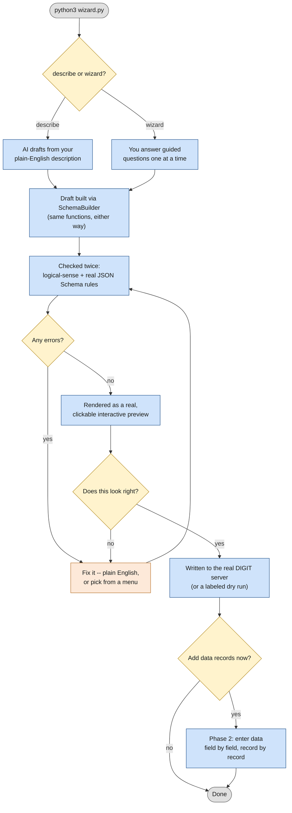
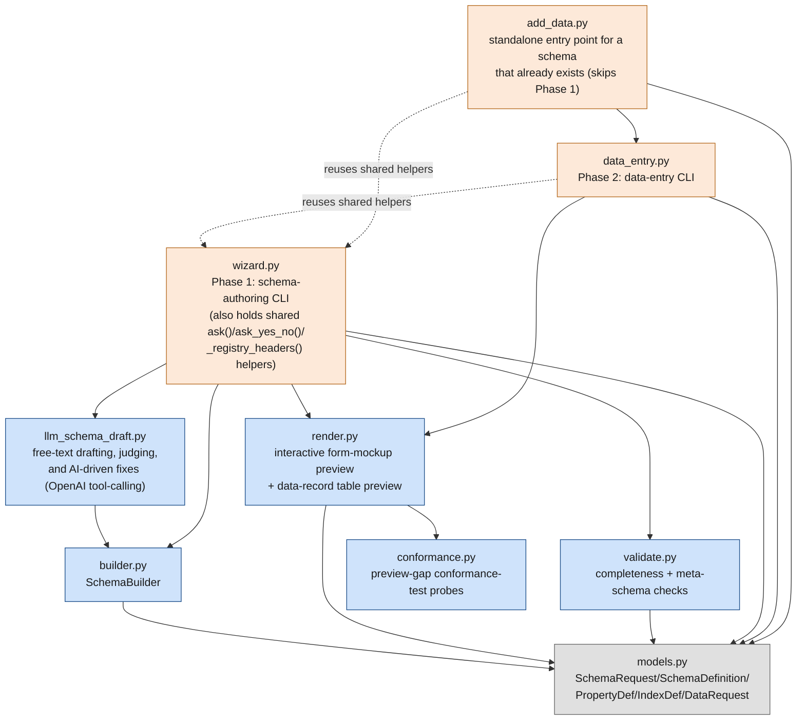

# Registry configuration prototype

## The flow, in plain terms

Run `python3 wizard.py` and this happens:

1. **Pick how to describe the schema** — type `describe` (say what you want in plain English, an
   AI drafts it) or `wizard` (answer one guided question at a time). Either choice leads to the
   exact same steps below.
2. **A draft gets built** — either the AI, or you answering questions, calls a set of safe,
   pre-built "add a field"/"add a rule" functions one at a time. Neither the AI nor anything else
   ever writes the schema's JSON by hand.
3. **It gets checked twice** — once for "does this make logical sense" (every required field
   actually exists, a pattern is only on a text field, etc.), and once against the real, official
   JSON Schema rules.
4. **It gets rendered as a real, clickable preview** — an actual form you can fill out and click
   around in, not just a description of one. Anything the preview genuinely can't show gets an
   honest explanation plus a real pass/fail test proving how it actually behaves.
5. **You're asked "does this look right?"** If not, just describe what's wrong in plain English
   (or pick a specific fix from a menu) — nothing restarts from scratch.
6. **Once you confirm**, it's sent to the real DIGIT server (or, if you're not pointed at one,
   it prints exactly what *would* have been sent).
7. **Optionally**, you're asked to add actual data records now — a simpler, separate flow.



## What each file does, in one line

| File | What it does |
|---|---|
| `models.py` | The rulebook: what a valid field looks like, what a valid whole schema looks like. |
| `builder.py` | Actually builds a schema, one field/rule at a time — used identically whether a human or the AI is driving it. |
| `validate.py` | Proofreads the built schema for mistakes before it's shown or sent anywhere. |
| `render.py` | Draws the real, interactive preview page you click around in. |
| `conformance.py` | For anything the preview can't visually show, builds a real pass/fail test and proves it, instead of just describing it. |
| `llm_schema_draft.py` | Talks to the AI — drafts from your description, double-checks the draft, and applies your plain-English fixes. |
| `wizard.py` | The conductor — runs the whole flow above, start to finish. This is what you actually run. |
| `data_entry.py` | Phase 2 — asks for actual data values field by field, once a schema already exists. |
| `add_data.py` | A shortcut into Phase 2 for a schema that's already live on the server (skips authoring entirely). |

---

Step 2 of the config pipeline (see `../DEMO-2026-07-15.md`) — authors a DIGIT Registry schema for
**any JSON Schema Draft 2020-12 construct**, not a bounded subset, then a second phase that enters
data records against it. Two ways to author a schema, both ending at the same interactive preview:

- **Describe it in plain language** (`wizard.py`, type `describe`) — an LLM turns a free-text
  description into the schema, but *not* by writing raw JSON: it calls the same deterministic,
  self-validating `SchemaBuilder` tool methods a human would call one at a time, so the riskiest
  constructs (a conditional, a shared sub-shape, an "at least one item must satisfy X" rule) get
  real, incremental validation instead of a free-generation guess.
- **Answer guided questions** (`wizard.py`, type `wizard`) — the original one-field-at-a-time flow,
  unchanged, for anyone who prefers it or is scripting a fixture.

Both paths render through the **same interactive form-mockup preview**: a real conditional field
toggles visibility live as you fill in its trigger field, a `oneOf`/`anyOf` renders as a real
alternative-picker, a shared `$ref`'d sub-shape resolves and renders inline wherever it's used,
recursively nested arbitrarily deep. Whatever the preview genuinely can't visualize (`contains`/
`minContains`, `prefixItems`, `propertyNames`, `patternProperties`/`unevaluatedProperties` nested
one level in, an unrecognized `allOf`/`not`) gets a **"preview gap" panel** instead of being
silently dropped — a plain-language explanation, honestly labeled "needs review," backed by an
**actual conformance-test run**: a concrete example built to satisfy the rule and one built to
violate it, both validated against the real `jsonschema.Draft202012Validator`, with the executed
pass/fail result shown, not just asserted. A completeness score (what fraction of the schema is
fully interactive vs. explained-but-not-visualized) and an explicit acknowledgment checkbox are
required before Submit whenever anything is below 100%.

If a preview shows something wrong, **just describe the fix in plain language too** — the same
tool-calling architecture applies it (remove a field, flip required/optional without losing its
other constraints, add a new rule), rather than the old fixed field-by-field re-ask.

Same shape as `../workflow-prototype/`: a testable builder layer driven by both the interactive CLI
and automated tests, a deterministic validate step, a preview a non-technical user can actually
read, an explicit confirmation gate, and a real-or-dry-run write.

Contract verified directly against the real Go source in `digitnxt/digit3`
(`src/services/registry/internal/models`, handlers, DB migrations) — not just `swagger.yaml`,
because the spec and the implementation disagree in several places (below).

Also stress-tested against every registry schema/data example found by scraping the **entire
digitnxt GitHub org** (all 8 repos, not just `digit3`) — `digit-specs`, `digit-client-tools`,
`examples`, `license-certificate`, `digit-trial`, `decision` — searched via GitHub code search
plus full repo tree listings for `registry`/`schema` filenames. Real schemas found this way
(`fixtures/real_world/`) turned up patterns this prototype didn't support yet (nested objects,
`pattern`, `minimum`/`maximum`) and a schema code containing a dot that the original validation
regex would have rejected — see "Real discrepancies found" below.

## What's runnable right now, no API key or live service needed

```
python3 test/test_schema_builder.py      # SchemaBuilder + validate.py, 98 checks
python3 test/test_wizard.py              # the interactive layer itself, 56 checks
python3 test/test_render.py              # offline-safety + structural correctness, 123 checks
python3 test/test_render_robustness.py   # malformed/adversarial input torture tests, 320 checks
python3 test/test_render_validation.py   # the embedded client-side JS validation logic, 28 checks
python3 test/test_preview_gaps.py        # the "preview gap" panel + completeness score, 140 checks
python3 test/test_conformance.py         # the conformance-test-mode probe engine, 165 checks
python3 test/test_llm_schema_draft.py    # the LLM tool-call dispatcher, no network, 69 checks
python3 test/test_write_path.py          # real HTTP paths against a throwaway local server, 20 checks
```

1019 checks total, verified on both Python 3.14 and 3.9 (the two interpreters this prototype's
been tested under — `pydantic`/`jsonschema` behave identically on both, but dict-ordering and
`re` edge cases have differed before, so both run every pass).

```
python3 wizard.py
```

The actual interactive CLI. First choice: `describe` (free-text, AI-drafted) or `wizard` (guided
step-by-step questions) — see the "Any JSON Schema" section below for what `describe` actually
does under the hood. Either way: draft → render the interactive preview → explicit confirmation →
write (real `POST /registry/v3/schema` or a clearly-labeled dry run). Saying "no" at confirmation
never discards the session — it offers a menu to redo/add/delete a field, or (new) **just describe
what's wrong in plain language** and it gets applied the same way the initial draft was built. Say
yes to adding data afterward: Phase 2, one question per field per record, repeatable, a plain table
preview (records don't get the interactive form-mockup treatment — a deliberate scope decision, not
an oversight, since re-rendering already-filled-in data as a live form added no real value here) →
confirmation → write (one `POST /registry/v3/<code>/data` per record).

```
python3 add_data.py [schema-code]
```

A separate entry point for a schema that already exists on the server — skips schema authoring
entirely. Fetches the real definition via `GET /registry/v3/schema/:schemaCode` (needs
`DIGIT_SERVER_URL`/`DIGIT_TENANT_ID`/`DIGIT_USER_ID` set; there's no dry-run form of this, since
there's nothing to preview without knowing the real fields), then runs the same record-entry flow
as `wizard.py`'s phase 2.

## Any JSON Schema, not a bounded subset — how the free-text path actually works

The registry service itself stores `definition` as an opaque blob server-side — it never enforced
the bounded property/constraint/index subset this prototype originally modeled; that restriction
was entirely self-imposed, to keep the guided wizard's fixed Q&A tractable. A real DIGIT technical
architect flagged this as insufficient: real schemas need `if`/`then`/`else`, `oneOf`/`anyOf`/
`allOf`, `dependentRequired`/`dependentSchemas`, `$ref`, `contains`/`minContains`,
`patternProperties`/`propertyNames`/`unevaluatedProperties`, `prefixItems`, and nesting past one
level (confirmed in the wild — see "Real schemas found" below).

A business user won't reliably know how to *ask* for these by JSON Schema keyword name — "field B
is only required when field A is X" is something they'd say in plain English, not something they'd
think to phrase as "add an `allOf`/`if`/`then` block." So drafting and confirming are solved two
different ways:

- **Drafting** (`llm_schema_draft.py`): the user describes the form freely; an LLM (`gpt-4o` by
  default — see that function's docstring for the side-by-side comparison against `gpt-4o-mini`,
  which reliably handled simple fields/conditionals but consistently mishandled compound constructs
  across repeated live-tested runs) turns that into a schema by calling **15 deterministic
  `SchemaBuilder` tool methods**: `add_field`/`add_nested_field` (plain fields, one level of
  nesting), `add_conditional` (`if`/`then`), `add_dependent_required`/`add_dependent_schema`
  (presence-triggered requirements/new fields), `add_one_of_field` (`oneOf`/`anyOf`),
  `add_pattern_properties`/`add_not_constraint`, `define_reusable_schema`/`add_ref_field` (`$ref`
  reuse — and the mechanism for nesting past one level, by writing the whole multi-level shape out
  at once), `add_raw_property` (a last-resort escape hatch for anything else — `contains`/
  `minContains`, `prefixItems`, `propertyNames`/`unevaluatedProperties`, or any combination),
  `add_unique_constraint`/`add_index`, and `remove_field`/`set_required` (for the fix loop below).
  Each tool validates its own inputs the same way `add_nested_field` always rejected a non-object
  parent, so a mistake surfaces as a tool error the model can react to, instead of silently
  reaching the rendered preview. A second, independent LLM call (`judge_schema_against_description`,
  always `gpt-4o`) then compares the draft against the *original* description and flags likely
  mismatches — informational only, never a gate; the interactive preview + human confirm is still
  the thing that actually catches what the judge might miss.
- **Confirming** (`render.py`'s `render_schema_form_preview`): there's no way to guarantee a
  plain-language description was precise, so the real check happens at the preview, not the input.
  It takes a plain `dict`, not a typed model — the same renderer accepts whatever the wizard's
  bounded `SchemaBuilder` produces or whatever a freely LLM-drafted schema produces, walking it with
  `.get()` throughout rather than assuming any fixed shape. See "Preview gaps and conformance-test
  mode" below for what happens when a construct can't be rendered as a live control.
- **Fixing** (`llm_schema_draft.py`'s `apply_fix_from_description`, wired into `wizard.py`'s
  `offer_fix_schema`): unrecognized input at the "what do you want to fix?" prompt — anything that
  isn't `add`/`delete FIELD_NAME`/`rename`/`constraints`/an exact field name — is treated as a
  free-text fix request and applied via the same tool-calling loop, seeded with the *current*
  schema so the model changes only what the feedback actually implies. `set_required` specifically
  exists so flipping a field's required-ness doesn't require recreating it (and losing whatever
  pattern/enum/etc. it already had).
- **Judge-result logging** (`log_judge_result`, `judge_log.jsonl`, gitignored — a local, growing
  log, not committed): every judge call, not just disagreements, so a false-negative rate (the
  judge said "ok" but a human later found a real problem) can eventually be measured, not just a
  false-positive rate. Each entry also carries a `preview_coverage` snapshot (the same completeness
  score the preview shows, reduced to just the summary numbers) — once a sample of entries gets a
  human `human_verdict` label, this is what lets low preview coverage be correlated against
  correction rate and judge confidence, turning this from a debugging trail into a closed-loop
  quality dataset.

## Preview gaps and conformance-test mode

If a business user can create a schema the interactive preview can't fully represent, the system
has to make that limitation explicit — otherwise they might think the preview is complete when it
isn't. Every construct the renderer can't turn into a live control gets a **"preview gap" panel**
instead of being silently dropped: a "Needs review" badge, which keyword(s) are involved, a
business-language explanation of what the rule means (using the schema's own actual values where
recognizable — a real field name, a real pattern, a real count — not a generic placeholder), what
specifically the preview can't show, and a reassurance that the Registry Service still enforces it
regardless.

**Conformance-test mode** goes one step further: for the exact recognized shapes above (a `const`/
`enum` condition, a recognized digit-count pattern), it builds a concrete JSON value that satisfies
the flagged rule and one that violates it, then validates both with the real
`jsonschema.Draft202012Validator` — the same library `validate.py` already uses for schema-syntax
checks — and shows the actual executed PASS/FAIL result in the panel, not just a description. Four
honestly distinct outcomes, never collapsed into one another: behaved as expected; **surprising**
(the rule genuinely doesn't behave as described — the single most valuable thing this can catch);
**inconclusive** (the example also had to satisfy some *other* constraint on the same field this
probe didn't account for, so it doesn't confirm or refute the flagged rule either way — using
`jsonschema.ValidationError.schema_path` to tell "the flagged construct misbehaves" apart from "an
unrelated sibling keyword caused this," which several real bugs turned out to be); and **errored**
(the validator itself raised, so no claim is made at all). Anything the probe can't confidently
build a test for reports an honest reason instead of guessing — never a fabricated result.

A completeness score ("Form Preview 92% complete — 23 fully visualized, 2 explained here, 0 not
explained") is computed the same way for the CLI (`print_preview_completeness`) and the rendered
page, and an explicit acknowledgment checkbox is required before Submit whenever it's below 100%.

## Real discrepancies found between swagger.yaml / the README / the Postman collection and the
## actual Go implementation (why this exists instead of trusting the spec)

- **Wrong API version everywhere except the code itself**: `swagger.yaml` and the service's own
  `README.md` both document `/registry/v1/...`. The real Gin router — variable literally named
  `v1` in the source, a copy-paste artifact — mounts everything at `/registry/v3/...`. Every
  request in this prototype uses `v3`.
- **The data route drops the `schema` path segment entirely, contradicting swagger.yaml**: the
  spec documents `/registry/v1/schema/{schemaCode}/data`. The real router
  (`cmd/server/main.go`) mounts `schemaRoutes := v1.Group("/schema")` (schema CRUD) and
  `dataRoutes := v1.Group("/:schemaCode/data")` as two *siblings* directly under `v1`
  (`/registry/v3`) — data routes are **not** nested under `/schema` at all. The real path is
  `/registry/v3/{schemaCode}/data`, not `/registry/v3/schema/{schemaCode}/data`. This one wasn't
  caught by the initial research pass (which read the documented shape rather than verifying this
  specific route against the router registration) and shipped as a real bug — a live write
  returned a bare `404 page not found` (Gin's own "no route matched," not our app's JSON error
  shape) even though the schema itself had been created successfully seconds earlier at the
  correctly-shaped `/registry/v3/schema` endpoint. `write_records()` in `data_entry.py` now uses
  the verified route.
- **`x-unique`/`x-indexes` are top-level fields on the create-schema *request body*, not nested
  inside `definition` — the most consequential mismatch found, because it fails silently.** The
  real `models.SchemaRequest` Go struct has `XUnique`/`XIndexes` as sibling fields of `Definition`
  (which is typed `json.RawMessage` — an opaque blob server-side). `CreateSchema`'s handler does
  `c.ShouldBindJSON(&request)` straight into that struct: anything nested inside the `definition`
  JSON that isn't part of `SchemaDefinition` is inert, never populating the real `XUnique`/
  `XIndexes` fields the server actually reads. The Postman collection's own example nests them
  inside `definition`, which is why this was modeled wrong here initially — **any schema created
  with an earlier version of this tool that included a unique constraint or an index almost
  certainly did not get that constraint/index applied server-side**, despite the create call
  returning `201 Created` (the server doesn't reject or warn about unrecognized keys inside the
  raw `definition` blob, so the request "succeeds" while silently dropping the constraint). If you
  created a schema before this fix and it needs real unique constraints or indexes, re-create it
  or `PUT` an update with the corrected shape. `models.py`'s `SchemaRequest` now has `x_unique`/
  `x_indexes` as top-level fields, matching the real struct, and both `SchemaRequest` and
  `SchemaDefinition` use `extra="allow"` so an unmodeled top-level keyword (a future one, or one a
  new LLM tool starts producing) round-trips instead of silently vanishing the same way;
  `test_write_path.py` asserts `x_unique`/`x_indexes` land at the top level of the actual JSON
  sent, not just that the Python objects compare equal (structural-equality tests alone couldn't
  have caught this, since fixing the code and fixing the test assertions together hides exactly
  this class of bug).
- **Wrong auth header, in three places at once**: `swagger.yaml`, the README, *and* the project's
  own `Registry_Collection.json` (Postman) all document/send `X-Client-Id` as the actor header.
  The real middleware (`internal/middleware/middleware.go`) only reads `X-User-Id`. Sending the
  documented header gets a 400 `"X-User-Id header is required"`. `_registry_headers()` in
  `wizard.py` sends `X-User-Id`, not what any of the docs say.
  - `DIGIT_USER_ID` is the env var this prototype reads for it, matching the workflow wizard's
    naming, not `DIGIT_CLIENT_ID`.
- **A body field that's parsed and then silently discarded**: the `_isExist` endpoint's request
  struct has a `tenantId` field the spec says overrides the header — the handler never reads it,
  always using the header value instead. Not exercised by this prototype (schema/data creation
  only), but a reminder that "the spec says X is optional/overridable" isn't always true.
- **Error response shape doesn't match the documented envelope**: swagger says errors come back
  as `{success, data, error, message}`; the real `writeError()` returns a bare JSON array
  `[{"code":..., "message":...}]`. `write_schema()`/`write_records()` don't try to parse a
  structured error body for this reason — on an HTTP error they print the raw response instead of
  assuming a shape that might not be there.
- **Response shape is config-dependent**: if the server's async-persistence mode is enabled,
  create/update/delete on data return `202 Accepted` with no body at all (fire-and-forget), rather
  than the synchronous `201`/`200` + record body swagger documents. `write_records()` only reads
  `resp["data"]["registryId"]` on success — if you point this at a server running in async mode,
  expect that read to fail; this prototype doesn't currently handle that mode.

## Real schemas found by scraping the whole org, and what they revealed

- **`digit-cli`'s own `test-registry-schema.yaml`/`test-registry-data.yaml`** are, byte for byte,
  the exact `test-license-registry` schema built through this wizard earlier — good independent
  confirmation the wizard's output matches what the DIGIT ecosystem itself considers a valid
  example.
- **`digit-cli`'s own `create-registry` Go command has the identical `x-unique`/`x-indexes`
  placement bug**, independently confirming the fix above was right: its
  `RegistrySchemaDefinition` YAML-parsing struct and `RegistrySchemaRequest` HTTP struct
  (`client-libraries/digit-library/digit/registry.go`) only have `SchemaCode`/`Definition` fields
  — there's nowhere for `x-unique`/`x-indexes` to go even if the YAML has them at the top level
  (which `digit-cli/test-registry-schema.yaml` does) or nested (which `digit-cli/example-schema.yaml`,
  an older/different-draft example, does) — either way, the official CLI silently drops them.
  Separately, its `CreateRegistryData` function POSTs to `/registry/v3/data?schemaCode=X` (query
  param), while its own `SeedRegistryData` function in the same file POSTs to
  `/registry/v3/{schemaCode}/data` (path param, matching the verified real route) — two different
  URL shapes for the same operation in one file; the query-param one contradicts the actual router
  and is almost certainly broken the same way this prototype's data-write bug was.
- **`digit-specs/v3.0.0/registry.yaml`'s own canonical example schema (`trade-license`) confirms
  `x-unique`/`x-indexes` belong at the top level** — independent confirmation from the spec repo
  itself, not just the Go source. It also uses a nested `address` object with a required `city`
  sub-field and two unique constraints (one single-field, one compound) — see `test_13`/
  `test_wiz_02b` below.
- **`docs/tutorials/backend/pgr2-registry-schema.yaml` (an official tutorial) has the identical
  `x-indexes`-nested-in-`definition` bug**, yet another independent instance of the same
  documentation mistake. `fixtures/real_world/pgr2.json` corrects this rather than reproducing the
  tutorial's own bug (see the `_comment_x_indexes_moved` note in that file). This tutorial is also
  where `pattern` (10-digit mobile, 6-digit pincode), `minimum`/`maximum` (lat/long bounds), and
  nested objects were found in the wild, prompting `models.py`/`builder.py`/`wizard.py` to support
  them (previously unsupported).
- **`examples/pgr/pgr-schemas/pgr-service-category-schema.yaml` uses a schema code containing a
  dot** (`PGR.ServiceCategory`) — the original `_SCHEMA_CODE_RE` (letters/numbers/`-`/`_` only)
  would have rejected a schema code DIGIT itself ships as an example. Fixed to allow dots.
- **Nested object properties are real and common, not hypothetical** — found independently in
  three unrelated sources (the `pgr2` tutorial, `digit-specs`' own canonical example, and
  `examples/pgr/pgr-schemas/registry-schema.yaml`), always for the same kind of field (an
  `address` or `auditDetails` group), and confirmed going past one level deep in the wild
  (`pgr2`'s own `address.auditDetails`). The **guided wizard's own UI** still only offers one level
  of interactive sub-questions (`configure_nested_fields()`; a deliberate scope decision, not an
  oversight — arbitrary recursive prompting wasn't judged worth the added complexity for a pattern
  seen at deeper levels only rarely) — but neither the underlying model
  (`PropertyDef.properties: Optional[dict[str, PropertyDef]]`, no depth limit) nor the renderer nor
  the free-text/AI drafting path share that cap: `render_schema_form_preview` recurses to whatever
  depth the dict actually has, and `define_reusable_schema`/`add_raw_property` let the LLM (or a
  hand-authored raw schema) express arbitrarily deep nesting directly. `test_14`/`test_wiz_02b`-
  `02d` confirm the model reproduces `pgr2`'s full two-level structure exactly; `test_preview_gaps.py`
  and the `demo/` fixtures confirm 3-4 levels render correctly through the free-text path.
- **`digit-trial`'s `services/common/registry/` is a different, unrelated "registry" service**
  (different routes entirely — `/registry/database`, `/registry/{name}/{version}/data`) — found
  during the scrape, explicitly not conflated with the `digit3` registry service this prototype
  targets.
- **`digit-cli/example-schema.yaml` is stale, broken cruft, not an alternate valid format** —
  confirmed by parsing it: its only top-level YAML key is `schema` (wrapping `code`/
  `description`/`definition`), but `createRegistry.go`'s `RegistrySchemaDefinition` struct only
  recognizes top-level `schemaCode`/`definition` keys. Running `digit create-registry --file
  example-schema.yaml` today would immediately fail the CLI's own `"definition is required"`
  check (`registryDef.Definition` would be `nil` since `definition` never appears at the level the
  parser looks for it). Confirmed via commit history: it was added in the same initial commit as
  the *working* `test-registry-schema.yaml`, then never updated when `createRegistry.go` was later
  changed — dead documentation left in the current tree, not a legacy-but-supported shape. Not
  modeled here, correctly.
- **`minLength`/`maxLength` are modeled on weaker evidence than `pattern`/`minimum`/`maximum`** --
  see models.py's docstring for the full account. `license-certificate/Schema-Registry-3.0.0.yaml`
  uses them repeatedly, but that file has no `schemaCode`/`x-indexes` anywhere — it's a different
  OpenAPI spec (that project's own module/UI-config API), and the usages found are on OpenAPI
  *request parameters*, not registry schema fields. Still standard JSON Schema 2020-12 keywords
  (the exact dialect the registry declares), so supporting them is low-risk and consistent with
  the other constraints, just not backed by a "found literally inside a real registry schema"
  example the way `pattern`/`minimum`/`maximum` are.

## Architecture — how the files connect



Three entry points, not one: `wizard.py` (author a schema — either path — then optionally add
data), `data_entry.py` (Phase 2 alone, imported by `add_data.py`), and `add_data.py` (skip
authoring entirely for a schema that's already live). The dashed arrows are the one wrinkle worth
naming — `data_entry.py` and `add_data.py` both reach back into `wizard.py` for its
`ask()`/`ask_yes_no()`/`_registry_headers()` helpers rather than duplicating them, so `wizard.py`
isn't purely "top of the graph" the way `wizard.py` is in the other two prototypes. `conformance.py`
is deliberately self-contained (no import of `render.py`, despite some overlapping pattern-
recognition logic) to avoid a circular import, since `render.py` calls into it to render probe
results inside the gap panel. `test/*.py` imports directly from whichever of these modules it's
testing, not shown above to keep this diagram to the library's own dependencies.

## Files

- `models.py` — `SchemaRequest`/`SchemaDefinition`/`PropertyDef`/`IndexDef`/`DataRequest`,
  matching the real Go structs. Schema definitions are genuine JSON Schema draft 2020-12, not a
  custom DIGIT format — confirmed against real example payloads, not assumed. `PropertyDef`
  supports `pattern`/`minimum`/`maximum`/`minLength`/`maxLength` and arbitrary-depth nested
  `properties`/`required` (self-referencing, `model_rebuild()`'d); `SchemaDefinition`/
  `SchemaRequest` union in raw-dict escape hatches (`oneOf`/`anyOf`, `$ref`, any construct
  `PropertyDef` can't represent) and use `extra="allow"` so nothing unmodeled silently vanishes —
  see "Real schemas found" and "Any JSON Schema" above.
- `builder.py` — `SchemaBuilder`, one method call per wizard question *or* per LLM tool call (the
  same methods serve both). Auto-generates camelCase field names from human-typed labels
  (`camel_field_name`). `add_nested_field()` adds one level of sub-fields under an object-type
  field; deeper nesting goes through `define_reusable_schema`/`add_raw_property` instead (see "Any
  JSON Schema" above). `_normalize_named_properties()` defensively drops anything under a raw
  `properties` dict that isn't a real sub-schema (a dict or bool) — found live-testing the LLM
  drafting loop hallucinating stray keys (a misplaced `required`, a bogus `format`) directly
  inside `properties` rather than where they belong. `add_conditional()` also backfills its
  trigger field's `enum` with the values actually used, so the field reliably renders as a
  dropdown instead of inconsistently free text.
- `validate.py` — deterministic completeness checks: schema code present and well-formed (letters/
  numbers/`.`/`-`/`_`), at least one field, every `required`/unique-constraint/index reference
  resolves to a real field (recursively, for nested groups too), `enum`/`pattern`/`minimum`/
  `maximum` only on types where they make sense, `minimum` not greater than `maximum`, plus a real
  JSON Schema meta-schema check (`jsonschema.Draft202012Validator.check_schema`) catching malformed
  regex/wrong keyword types the referential checks above wouldn't.
- `render.py` — `render_schema_form_preview()`: the interactive form-mockup preview, taking a plain
  `dict` (not a typed model) so it accepts any JSON Schema shape, not just what `PropertyDef` can
  represent. Deterministic mapping for common shapes (string/enum/date/pattern → the matching
  control; `object`+`properties` → a recursively-nested `<fieldset>`); real interactivity for
  `if`/`then`/`else`, `dependentRequired`/`dependentSchemas`, and `oneOf`/`anyOf` (inline vanilla
  JS, no external scripts — offline-safety is asserted by every test file that renders anything);
  a "preview gap" panel (see above) for anything else, never a silent drop. `render_data_preview()`
  is the original, unchanged table preview for Phase 2's filled-in records.
- `conformance.py` — turns a preview-gap panel's plain-English claim into executed proof: builds a
  concrete value satisfying the flagged rule and one violating it (only for the exact recognized
  "specific" shapes — const/enum conditions, the two digit-count pattern shapes `render.py`
  recognizes — anything else honestly reports it couldn't auto-generate a test), validates both
  with the real `jsonschema.Draft202012Validator`, and classifies the result as expected/
  surprising/inconclusive/errored (see "Preview gaps and conformance-test mode" above). Hard-caps
  how large a generated example can get (`_MAX_CONTAINS_PROBE_ITEMS`, `_MAX_PATTERN_PROBE_DIGITS`)
  after a schema-authored `minContains`/pattern-digit-count in the hundreds of millions was found
  live-testing to hang the render for several seconds building a huge instance. Never resolves a
  `$ref`/`$dynamicRef`/`$recursiveRef` of any kind (internal or external) before probing — safety
  over coverage, since an external one could otherwise make the real validator attempt a network
  fetch.
- `llm_schema_draft.py` — the free-text drafting/judging/fixing orchestration (OpenAI tool-calling,
  `gpt-4o` by default for both drafting and judging — see "Any JSON Schema" above for why). No
  network calls in its own tests; the live path is exercised manually against the real API.
- `wizard.py` — phase 1 interactive CLI: `describe`/`wizard` mode choice → fields/constraints (or
  free-text draft) → interactive preview → confirm → write. `run_schema_session()`/
  `run_llm_schema_session()` return the built schema, separate from the write step, so tests can
  drive either directly. `offer_fix_schema()` is shared by both paths — a field name to redo it
  (guided Q&A), `add`/`delete FIELD_NAME`/`rename`/`constraints`, or (new) any other text is
  treated as a free-text fix request and applied via `apply_fix_from_description`.
- `data_entry.py` — phase 2: one question per field per record, repeatable, table preview →
  confirm → write. Imports `ask`/`ask_yes_no`/`_registry_headers` from `wizard.py`.
  `ask_nested_record_value()` asks a group's sub-fields as their own set of questions; an optional
  group can be skipped entirely.
- `add_data.py` — standalone entry point for adding records to a schema that already exists on
  the server: fetches it via `GET /registry/v3/schema/:schemaCode`, then reuses `data_entry.py`'s
  flow. No schema authoring, no dry-run form.
- `test/test_schema_builder.py` — real examples (`license-registry`, `trade-license`, `pgr2`,
  `PGR.ServiceCategory`) plus one test per completeness check, one per builder tool (including the
  `oneOf`/`$ref`/`allOf`/`not`/`dependentRequired`/`dependentSchemas`/`patternProperties` escape
  hatches and the `add_conditional` enum-backfill/`_normalize_named_properties` rescue fixes).
- `test/test_wizard.py` — the interactive layer (both phases, both schema-authoring paths where
  relevant), driven via a mocked `input()`, against the same real fixtures and edge cases.
- `test/test_render.py` — offline-safety and structural correctness for the interactive form
  preview and the data-record table preview.
- `test/test_render_robustness.py` — malformed/adversarial schema fragments (wrong types, missing
  keys, deeply nested exotic combinations) thrown at the renderer, confirming it degrades to an
  honest raw-JSON/gap fallback rather than crashing.
- `test/test_render_validation.py` — the embedded client-side JS validation logic itself, run
  under a real `node` harness (not just inspected as a string), including the real submit-handler
  acknowledgment gate.
- `test/test_preview_gaps.py` — the "preview gap" panel, business-language explanations, and
  completeness score, including the exact real-world example this feature was built for
  (`contains`/`minContains` on a documents array — "at least one document must be approved").
- `test/test_conformance.py` — the conformance-test-mode probe engine: every recognized construct,
  the offline-safety guard, the DoS caps, and the surprising/inconclusive/errored classification.
- `test/test_llm_schema_draft.py` — the LLM tool-call dispatcher (all 15 tools), driven directly
  against `_execute_tool_call` — no network calls; the live drafting/judging/fixing path is
  exercised manually against the real OpenAI API.
- `test/test_write_path.py` — the real-POST paths (not just dry-run) against a throwaway local HTTP
  server, asserting the exact path/headers/body sent. Added after a live write 404'd because of
  the missing-`/schema/`-segment bug above -- dry runs alone can't catch a URL-construction bug
  since they never send a real request.
- `fixtures/` — `license_registry_schema_session.txt`/`license_registry_data_session.txt`/
  `trade_license_session.txt` (exact wizard answers), `*_golden.json` (verified output),
  `real_world/` (schemas scraped from across the digitnxt org, used as fidelity fixtures rather
  than hand-invented examples).
- `demo/` — verified, rendered example schemas across five different registry domains (trade
  license, birth certificate, building permit, water/sewer connection, marriage registration, plus
  one hand-authored raw schema with no builder involvement at all), each exercising a mix of
  conditionals, `$ref` reuse with nested sub-objects, `oneOf`/`anyOf`, `contains`/`minContains`,
  `patternProperties`, `not`, and `dependentRequired`/`dependentSchemas` — kept as reference/
  fallback artifacts, not test fixtures.
- `judge_log.jsonl` — gitignored; accumulates locally from real drafting sessions (see "Any JSON
  Schema" above).

## What this doesn't do (out of scope, not forgotten)

- `x-ref-schema` (cross-schema field references) and `webhook` (on-write callbacks) are real
  fields on the schema definition but aren't modeled — this prototype covers property/constraint/
  index authoring and record entry, not cross-schema linking or webhook wiring.
- Schema *updates* (`PUT /registry/v3/schema/:schemaCode`, which bumps `version`) aren't modeled
  — this prototype only creates new schemas.
- Async-persistence mode (see above) isn't handled by the write step.
- The guided wizard's own interactive flow only goes one level deep for nested object fields (a
  deliberate scope decision — see "Real schemas found" above). Neither the underlying model, the
  renderer, nor the free-text/AI drafting path share that cap.
- Phase 2 (filled-in data records) still renders as a plain table, not the interactive form
  treatment schema authoring gets — a deliberate scope call (re-rendering already-filled data as a
  live form added no real value), not an oversight.
- An external `$ref`/`$dynamicRef`/`$recursiveRef` is rendered as an honest "can't fetch this, this
  works fully offline" gap, never resolved over the network, by either the renderer or the
  conformance-test probe engine.
